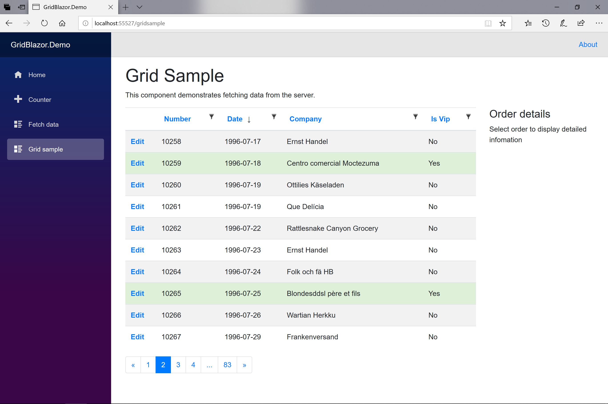

# Grid.Blazor

GridBlazor is a Blazor component that shows data in a grid. It requires a back-end component that performs paging, sorting, filtering and others. 

This back-end component can be one of the following:
- GridCore (v.6.0.0 or later), supporting ASP.Net Core 3.1, ASP.Net 5.0, ASP.Net 6.0, ASP.Net 7.0, ASP.Net 8.0 and ASP.Net 9.0. GridMvcCore, that it is a fork from https://gridmvc.codeplex.com/, was working for earlier versions. But GridMvcCore is only required for Blazor WASM (REST) and ASP.NET MVC projects now.
- an OData back-end. All samples are based on Microsoft.AspNetCore.OData library, but it can be any other OData provider.
- GridJavaCore back-end for Java JPA / Hibernate projects (https://github.com/gustavnavar/Grid.Java.Core)

GridBlazor supports .NET Core 3.1 and 5.0, 6.0, 7.0, 8.0 and 9.0, and Blazor WebAssembly 3.2.0, 5.0, 6.0, 7.0, 8.0 and 9.0

## Demo 
- http://gridblazor.azurewebsites.net

## Documentation
There are native C# Grid components for Blazor client-side and server-side, and for ASP.NET Core MVC.

You can find the specific documentation for each environment clicking the following links:
* [Documentation for Blazor WASM with GridMvcCore back-end (REST API)](./docs/blazor_client/Documentation.md)
* [Documentation for Blazor WASM with GridCore back-end (gRPC)](./docs/blazor_grpc/Documentation.md)
* [Documentation for Blazor WASM with OData back-end](./docs/blazor_odata/Documentation.md)
* [Documentation for Blazor WASM with local data](./docs/blazor_local/Documentation.md)
* [Documentation for Blazor server-side](./docs/blazor_server/Documentation.md)
* [Documentation for ASP.NET Core MVC](./docs/dotnetcore/Documentation.md)
* [Using GridBlazor component for ASP.NET Core MVC](./docs/dotnetcore_blazor/Documentation.md)

This is an example of a table of items using this component:




## Migration to GridBlazor 3.5.0 and GridCore 5.5.0 from GridBlazor 3.0.0 and GridCore 5.0.0 for Blazor WASM projects with REST back-end

1. You have to remove the package ```GridCore``` and install the package ```GridMvcCore```, and upgrade the ```GridBlazor``` package

2. You must replace all ```GridCore``` instances by ```GridServer``` ones

3. The ```Grid``` property of the ```GridServer``` object has an ```SGrid<T>``` type, instead of ```ISGrid<T>``` it was before. You should change any reference to this property to reflect this change.

4. Some classes have been moved from the ```GridCore``` package to the ```GridMvc``` one. Change all required ```using ...``` as needed.


## Migration to GridBlazor 3.0.0 and GridCore 5.0.0 for all Blazor projects except Blazor WASM (REST) ones

1. You have to remove the package ```GridMvcCore``` and install the package ```GridCore```, and upgrade the ```GridBlazor``` package

2. You must replace all ```GridServer``` instances by ```GridCore``` ones

3. The ```Grid``` property of the ```GridCore``` object has an ```ISGrid<T>``` type, instead of ```SGrid<T>``` it was before. You should change any reference to this property to reflect this change.

4. Some classes have been moved from the ```GridMvc``` package to the ```GridCore``` one. Change all required ```using ...``` as needed.


## Migration to GridBlazor 3.0.0 and GridMvc 5.0.0 for Blazor WASM (REST) projects

1. You have to upgrade the ```GridMvcCore``` and ```GridBlazor``` packages

2. The ```Grid``` property of the ```GridServer``` object is of type ```ISGrid<T>```, instead of ```SGrid<T>``` it was before. You should change any reference to this property to reflect this change.

3. Some classes have been moved from the ```GridMvc``` package to the ```GridCore``` one. Change all required ```using ...``` as needed.


## Notes

- GridBlazor 6.0.0 supports the following CSS frameworks:
    - Bootstrap_4 https://getbootstrap.com/docs/4.0/getting-started/introduction/ (default)
    - Bootstrap_5 https://getbootstrap.com/docs/5.0/getting-started/introduction/
    - Bootstrap_3 https://getbootstrap.com/docs/3.4/getting-started/
    - Materialize https://materializeweb.com/
    - Bulma https://bulma.io/

- GridBlazor 3.4.1 supports the build-in InputFile component for columns of type "file" for .Net 6.0 and later projects. The old Agno.BlazorInputFile component is ussed for .Net Core 3.1 and .Net 5.x projects. See https://github.com/gustavnavar/Grid.Blazor/blob/master/docs/blazor_client/Crud.md#file-type-columns

- GridBlazor 3.0.0 supports .Net 6.0

- GridMvcCore has been split in 2 parts from version 5.0.0 on:
    - GridCore: it includes all code necessary for the back-end Blazor applications (data processing, filtering, sorting, etc.), excluding all MVC dependencies (Razor view and pages rendering).
    - GridMvcCore: it only includes all MVC dependencies required for rendering Razor views and pages.

- Sorting is implemented on GridBlazor 2.1.2, GridMvcCore 4.1.2 and newer versions following this sequence "no sort" -> "sort ascending" -> "sort descending" -> "no sort" and so on when a column title is clicked 

- GridMvcCore 3.0.0 does not support .Net Core 2.x. It requires .NET Core 3.1

- GridBlazor 1.6.7 requires a change on the column definition when selecting rows with checkboxes using the ```SetCheckboxColumn``` method. It's mandatory to identify the columns that are primary keys for the grid. You must do it using the SetPrimaryKey(true) method for the primary key columns' definitions:

    ```c#
        c.Add("CheckboxColumn").SetCheckboxColumn(true, o => o.Customer.IsVip);
        c.Add(o => o.OrderID).SetPrimaryKey(true);
    ```

- GridBlazor 1.6.2 doesn't support the ```CheckedRows``` property anymore. ```CheckedRows``` only allowed to retrieve the checked values, but not to change them. Use the ```Checkboxes``` property instead of it.

- GridBlazor 1.5.0 supports OData server back-ends for Blazor WA applications. More info [here](./docs/blazor_odata/Documentation.md)

- Versions before GridBlazor 1.3.9 had the keyboard navigation enabled by default. This feature requires to focus on the grid element, but it can create problems when used on pages with 2 or more grids. As a consequence, starting with version 1.3.9 it has to be explicitly configured for each grid that requires keyboard navigation. Users can enable keyboard navigation between pages using the ```SetKeyboard``` method of the ```GridClient``` object:

    ```c#
        var client = new GridClient<Order>( ... ).SetKeyboard(true);
    ```

- Grid components have been moved to ```GridBlazor.Pages``` folder in GridBlazor 1.3.2. You must add a reference to this namespace in the ```_Imports.razor```: 

    ```razor
        @using GridBlazor.Pages
    ```

- Blazor Server App require these changes on to the **_Host.cshtml** file for .Net Core 3.1:
    
    ```html
        <link href="_content/GridBlazor/css/gridblazor.min.css" rel="stylesheet" />
        <script src="_content/GridBlazor/js/gridblazor.js"></script>
    ```

- Blazor WebAssembly projects require these changes on to the **wwwroot/index.html** file for version 3.2.0 Preview 1:
    
    ```html
        <link href="_content/GridBlazor/css/gridblazor.min.css" rel="stylesheet" />
        <script src="_content/GridBlazor/js/gridblazor.js"></script>
    ```

- Blazor WebAssembly projects require to use a new constructor of the **GridClient** object including an HttpClient object from Dependency Injection for .Net Core 3.1:
    
    ```razor
        @page "/..."
        @inject HttpClient httpClient

        ...
    
        protected override async Task OnParametersSetAsync()
        {
            ...
            var client = new GridClient<Order>(httpClient, url, query, false, "ordersGrid", Columns);
            ...
        }
    
    ```

- The button to clear all filters is disabled by default starting from ```GridBlazor``` version 1.3.6. You can enable it using the ***ClearFiltersButton*** method of the **GridClient** object:  

    ```razor
        var client = new GridClient<Order>(httpClient, url, query, false, "ordersGrid", Columns).ClearFiltersButton(true);
    ```

## Change Log
https://github.com/gustavnavar/Grid.Blazor/releases

## Folder description
* [GridBlazor](./GridBlazor): Library to build the GridBlazor package
* [GridMvc](./GridMvc): Library to build the GridMvcCore package
* [GridCore](./GridCore): Library to build the GridCore package
* [GridShared](./GridShared): Library to build the GridShared package
* [GridBlazorClientSide.Client](./GridBlazorClientSide.Client): Front-end project for the Blazor WebAssembly (REST API) demo
* [GridBlazorClientSide.Server](./GridBlazorClientSide.Server): Back-end project for the Blazor WebAssembly (REST API) demo
* [GridBlazorClientSide.Shared](./GridBlazorClientSide.Shared): Shared project for the Blazor WebAssembly (REST API) demo
* [GridBlazorGrpc.Client](./GridBlazorGrpc.Client): Front-end project for the Blazor WebAssembly (gRPC) demo
* [GridBlazorGrpc.Server](./GridBlazorGrpc.Server): Back-end project for the Blazor WebAssembly (gRPC) demo
* [GridBlazorGrpc.Shared](./GridBlazorGrpc.Shared): Shared project for the Blazor WebAssembly (gRPC) demo
* [GridBlazorOData.Client](./GridBlazorOData.Client): Front-end project for the Blazor WebAssembly with OData server demo
* [GridBlazorOData.Server](./GridBlazorOData.Server): Back-end project implementing an OData server for the Blazor WebAssembly demo
* [GridBlazorOData.Shared](./GridBlazorOData.Shared): Shared project for the Blazor WebAssembly with OData server demo
* [GridBlazorStandalone](./GridBlazorStandalone): Project for the Blazor WebAssembly with local data demo
* [GridBlazorServerSide](./GridBlazorServerSide): Blazor Server App demo
* [GridBlazorJava](./GridBlazorJava): Front-end project for the Blazor WebAssembly (REST API with Java JPA / Hibernate back-end projects) demo
* [GridMvc.Demo](./GridMvc.Demo): ASP.NET Core MVC demo
* [GridBlazor.Tests](./GridBlazor.Tests): Unit tests for the GridBlazor library
* [GridMvc.Tests](./GridMvc.Tests): Unit tests for the GridMvcCore library
* [docs](./docs): Documentation

The SQL Server database for all demos can be downloaded from [here](./GridMvc.Demo/App_Data)

Alternatively, if you prefer to install a fresh version of the database you can perform the following steps:
- run this script from Microsoft web to create a new database: https://github.com/microsoft/sql-server-samples/blob/master/samples/databases/northwind-pubs/instnwnd.sql
- add a column to the Customers table with the name IsVip of type bit (NOT NULL) and default value 0:
    ```sql
        USE Northwind;
        ALTER TABLE dbo.Customers ADD IsVip bit NOT NULL DEFAULT 0 WITH VALUES;
        GO
    ```
- change manually some values of the new IsVip column to True
- review the datetime columns. Any mismatch between EF Core model and database definitions will produce an exception and filtering will not work as expected. If database columns are defined as ```datetime``` you must modify the ```NorthwindDbContext``` class including:
    ```c#
        modelBuilder.Entity<Order>().Property(r => r.OrderDate).HasColumnType("datetime");
    ```
    for each datetime column. Or you can change all database columns' type to ```datetime2(7)```.

