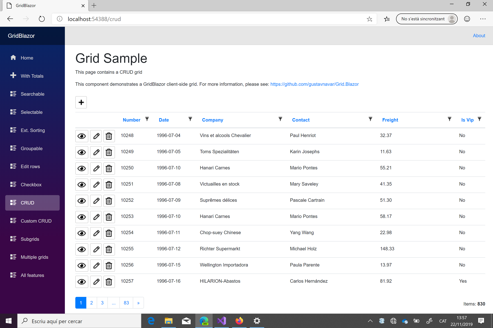
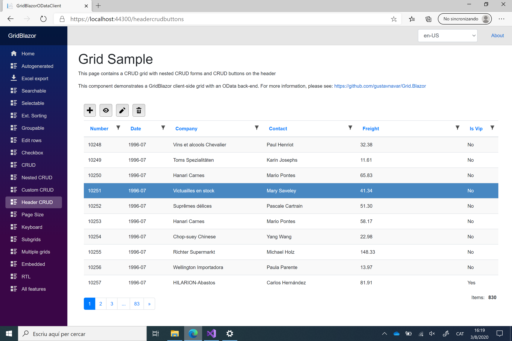

## Blazor WASM with GridCore back-end (gRPC)

# CRUD

[Index](Documentation.md)

GridBlazor supports CRUD forms to add, edit, view and delete items for Blazor client-side projects.

These are the supported features:
- Full screen forms
- Auto-generated forms with field type detection based on column definition
- Lists for drop-drown fields
- Custom forms
- Support of grid models including 1:N relationships
- Support of entities with multiple foreign keys
- Direct URLs

## Auto-generated forms

In first place we will create an interface in the Shared project for the gRPC service used by Client and Server projects. We will need 4 methods for all CRUD operations. The interface must use the ServiceContract attribute:
 ```c#
    [ServiceContract]
    public interface IOrderService
    {
        ValueTask<Response> Create(Order order);
        ValueTask<Order> Get(Order order);
        ValueTask<Response> Update(Order order);
        ValueTask<Response> Delete(Order order);
    }
```

Then you can enable CRUD using the **Crud(bool enabled, ICrudDataService<T> crudDataService)** method of the **GridClient** object:
```c#   
    var client = new GridClient<Order>(gridClientService.OrderColumnsWithCrud, query, false, "ordersGrid",
            ColumnCollections.OrderColumnsWithCrud, locale)
        .Crud(true, orderService)
```

You can also enable CRUD depending on a condition for each row using the **Crud(bool createEnabled, Func<T, bool> enabled, ICrudDataService<T> crudDataService)** method:
```c#   
    var client = new GridClient<Order>(gridClientService.OrderColumnsWithCrud, query, false, "ordersGrid",
            ColumnCollections.OrderColumnsWithCrud, locale)
        .Crud(true, r => r.Customer.IsVip, orderService)
```
The create form can only be enabled using a ```bool``` parameter. But the read, update and delete forms can be enabled using a function that returns a ```bool```.

**Note**: All 4 crud forms can be enabled at the same time with the former methods, but you can enable one by one using ```Crud(bool create, bool read, bool update, bool delete, ICrudDataService<T> crudDataService)``` or ```Crud(bool createEnabled, Func<T, bool> readEnabled, Func<T, bool> updateEnabled, Func<T, bool> deleteEnabled, ICrudDataService<T> crudDataService)``` methods.

The parameter **crudDataService** of the **Crud** method must be a class that implements the **ICrudDataService<T>** interface on the front-end project. 

This interface has 4 methods:
- ```Task<T> Get(params object[] keys);```
- ```Task Insert(T item);```
- ```Task Update(T item);```
- ```Task Delete(params object[] keys);```
one for each CRUD operation.

These 4 methods will call the gRPC service in the back-end using the ```IOrderService``` interface

This is an example of those 4 methods:
```c#
    public class OrderClientService : ICrudDataService<Order>
    {
        private readonly string _baseUri;

        public OrderClientService(NavigationManager navigationManager)
        {
            _baseUri = navigationManager.BaseUri;
        }

        public async Task<Order> Get(params object[] keys)
        {
            int orderId;
            int.TryParse(keys[0].ToString(), out orderId);

            var handler = new GrpcWebHandler(GrpcWebMode.GrpcWeb, new HttpClientHandler());
            using (var channel = GrpcChannel.ForAddress(_baseUri, new GrpcChannelOptions() { HttpClient = new HttpClient(handler) }))
            {
                var service = channel.CreateGrpcService<IOrderService>();
                return await service.Get(new Order { OrderID = orderId });
            }
        }

        public async Task Insert(Order item)
        {
            var handler = new GrpcWebHandler(GrpcWebMode.GrpcWeb, new HttpClientHandler());
            using (var channel = GrpcChannel.ForAddress(_baseUri, new GrpcChannelOptions() { HttpClient = new HttpClient(handler) }))
            {
                var service = channel.CreateGrpcService<IOrderService>();
                var result = await service.Create(item);
                if (result.Ok)
                {
                    item.OrderID = result.Id;
                }
                else
                {
                    throw new GridException("ORDSRV-01", "Error creating the order: " + result.Message);
                }
            }
        }

        public async Task Update(Order item)
        {
            var handler = new GrpcWebHandler(GrpcWebMode.GrpcWeb, new HttpClientHandler());
            using (var channel = GrpcChannel.ForAddress(_baseUri, new GrpcChannelOptions() { HttpClient = new HttpClient(handler) }))
            {
                var service = channel.CreateGrpcService<IOrderService>();
                var result = await service.Update(item);
                if (!result.Ok)
                {
                    throw new GridException("ORDSRV-02", "Error updating the order: " + result.Message);
                }
            }
        }

        public async Task Delete(params object[] keys)
        {
            int orderId;
            int.TryParse(keys[0].ToString(), out orderId);

            var handler = new GrpcWebHandler(GrpcWebMode.GrpcWeb, new HttpClientHandler());
            using (var channel = GrpcChannel.ForAddress(_baseUri, new GrpcChannelOptions() { HttpClient = new HttpClient(handler) }))
            {
                var service = channel.CreateGrpcService<IOrderService>();
                var result = await service.Delete(new Order { OrderID = orderId });
                if (!result.Ok)
                {
                    throw new GridException("ORDSRV-03", "Error deleting the order: " + result.Message);
                }
            }
        }
    }
```

You will need a gRPC service to perform the CRUD operation on the back-end that must implement the IOrderService interface.

This is an example of this type of service:
  
```c#
    public class OrderServerService : IOrderService
    {
        private readonly NorthwindDbContext _context;

        public OrderServerService(NorthwindDbContext context)
        {
            _context = context;
        }

        public async ValueTask<Response> Create(Order order)
        {
            if (order == null)
            {
                return new Response(false);
            }

            var repository = new OrdersRepository(_context);
            try
            {
                await repository.Insert(order);
                repository.Save();

                return new Response(true, order.OrderID);
            }
            catch (Exception e)
            {
                return new Response(e);
            }
        }

        public async ValueTask<Order> Get(Order order)
        {
            var repository = new OrdersRepository(_context);
            return await repository.GetById(order.OrderID);
        }

        public async ValueTask<Response> Update(Order order)
        {
            if (order == null)
            {
                return new Response(false);
            }

            var repository = new OrdersRepository(_context);
            try
            {
                await repository.Update(order);
                repository.Save();

                return new Response(true);
            }
            catch (Exception e)
            {
                return new Response(e);
            }
        }

        public async ValueTask<Response> Delete(Order order)
        {
            var repository = new OrdersRepository(_context);
            Order attachedItem = await repository.GetById(order.OrderID);

            if (attachedItem == null)
            {
                return new Response(false);
            }

            try
            {
                repository.Delete(attachedItem);
                repository.Save();

                return new Response(true);
            }
            catch (Exception e)
            {
                return new Response(e);
            }
        }
    }
```

### Column definition

The column definition must include the primary keys:
- using the **SetPrimaryKey(true)** method for columns with auto-generated keys, or
- using the **SetPrimaryKey(true, false)** method for columns with manually generated keys, or
- using the **SetPrimaryKey(true).SetSelectField(...)**  method for columns with keys selected from a list

If the grid model includes foreign keys, the column definition should include them using the **SetSelectField** in order to get the options for the ```<select>``` element.

The **SetSelectField** method has 3 required parameters:
Parameter | Description
--------- | -----------
enabled | boolean to configure if the field is shown as a ```<select>``` html element
expression | function to get the selected value for update and delete forms (it must return an string value)
selectItemExpr | function to get the values and titles to be shown in the drop-down of create and update forms (it can has no parameter or the item row as a parameter, and it must return a ```IEnumerable<SelectItem>```)

The type of fields currently supported as foreign keys are:
- string
- DateTime
- DateTimeOffset
- TimeSpan
- Int16
- Int32
- Int64
- UInt16
- UInt32
- UInt64
- Byte
- Single
- Double
- Decimal
- bool
- Guid

This is an example of front-end gRPC service to get values and titles for a drop-down:

```c#
    public async Task<IEnumerable<SelectItem>> GetAllShippers()
    {
        var handler = new GrpcWebHandler(GrpcWebMode.GrpcWeb, new HttpClientHandler());
        using (var channel = GrpcChannel.ForAddress(_baseUri, new GrpcChannelOptions() { HttpClient = new HttpClient(handler) }))
        {
            var service = channel.CreateGrpcService<IGridService>();
            return await service.GetAllShippers();
        }
    }
```

And this is an example of back-end gRPC service to send values and titles to the front-end service:

```c#
    public class GridServerService : IGridService
    {
        ...

        public async ValueTask<IEnumerable<SelectItem>> GetAllShippers()
        {
            var repository = new ShipperRepository(_context);
            return await repository.GetAll()
                    .Select(r => new SelectItem(r.ShipperID.ToString(), r.ShipperID.ToString() + " - " + r.CompanyName))
                    .ToListAsync();
        }
    }
```

Other fields that you want to be shown as dropdowns with a closed list can also be configured with the ```SetSelectField``` method.

All fields to be included in the CRUD forms but not in the grid as columns should be configured as hidden (e.g. ```Add(o => o.RequiredDate, true)```).

Boolean columns are shown as checkboxes on CRUD forms by default. But they can also be shown as sliders using the ```SetToggleSwitch``` method in the column definition (e.g. ````SetToggleSwitch(true, "Yes", "No")```).
The ```SetToggleSwitch``` method has 3 required parameters:
Parameter | Description
--------- | -----------
enabled | boolean to configure if the boolean field is shown as a slider
trueLabel | optional string to define the checked value label
falseLabel | optional string to define the unchecked value label

All columns required to be included in the Create and/or Update forms as **read only** should be configured using the ```SetReadOnlyOnCreate(true)``` and ```SetReadOnlyOnUpdate(true)``` methods.
You can also configure the "read only on create" and/or "read only on update" behaviors for each row depending on its values using the ```SetReadOnlyOnCreate(Func<T, bool> readOnlyOnUpdate)``` and ```SetReadOnlyOnUpdate(Func<T, bool> readOnlyOnUpdate)``` methods.

If a column is a date that has to be shown as ```date```, ```time```, ```week```, ```month``` or ```datetime-local``` in the CRUD forms, the column definition should use the  **SetInputType** method in order to get the correct format.

If a column is a string that has to be shown as ```<textarea>``` in the CRUD forms, the column definition should use the  **SetTextArea** or the  **SetInputType** method in order to get the correct html element.

The **SetInputType** method has 1 required parameter:
Parameter | Description
--------- | -----------
inputType | ```InputType``` enum. Its value can be ```InputType.TextArea```, ```InputType.Date```, ```InputType.Time```, ```InputType.Month```, ```InputType.Week``` or ```InputType.DateTimeLocal```

The **SetTextArea** method has 1 optional parameter:
Parameter | Description
--------- | -----------
rows | integer to select the number or rows of the ```<textarea>``` element

You can also add components on the CRUD forms using the ```RenderCrudComponentAs<TComponent>``` method. You must define these columns as **Hidden** to show them just on CRUD forms.

You can configure the width of the column input element using the ```SetCrudWidth(int width)``` and ```SetCrudWidth(int width, int labelWidtth)``` methods. The default value for the column width is 5 and and for the label width is 2. You can configure them from 1 to 11, but the sum of both can not be more than 12.

And finally all columns included in the grid but not in the CRUD forms should be configured as "CRUD hidden" using the ```SetCrudHidden(true)``` method.

**Notes**: 
- You can have more granularity in the "CRUD hidden" configuration. You can use the ```SetCrudHidden(bool create, bool read, bool update, bool delete)``` method to configure the columns that will be hidden on each type of form. You can also use the ```SetCrudHidden(Func<T,bool> create, Func<T,bool> read, Func<T,bool> update, Func<T,bool> delete)``` method to configure the columns that will be hidden on each type of form depending on the value of ```T``` properties.
- You can have more granularity in the components configuration.  You can use the ```RenderCrudComponentAs<TCreateComponent, TReadComponent, TUpdateComponent, TDeleteComponent>``` method to configure the components that will be shown on each type of form. Id you don't want to show any component for a specific type of form you must use ```NullComponent```

This is an example of column definition:

```c#
    public static Action<IGridColumnCollection<Order>, Func<Order, Task<IEnumerable<SelectItem>>>, 
            Func<Order, Task<IEnumerable<SelectItem>>>, Func<Order, Task<IEnumerable<SelectItem>>>> 
            OrderColumnsWithCrud = (c, customers, employees, shippers) =>
    {
        c.Add(o => o.OrderID).SetPrimaryKey(true);
        c.Add(o => o.CustomerID, true).SetSelectField(true, o => o.Customer.CustomerID + " - "
            + o.Customer.CompanyName, customers);
        c.Add(o => o.EmployeeID, true).SetSelectField(true, o => o.Employee.EmployeeID.ToString() + " - "
            + o.Employee.FirstName + " " + o.Employee.LastName, employees);
        c.Add(o => o.ShipVia, true).SetSelectField(true, o => o.Shipper == null ? "" : o.Shipper.ShipperID.ToString()
            + " - " + o.Shipper.CompanyName, shippers);
        c.Add(o => o.OrderDate, "OrderCustomDate").Titled(SharedResource.OrderCustomDate).Format("{0:yyyy-MM-dd}").SetCrudWidth(3);
        c.Add(o => o.Customer.CompanyName).Titled(SharedResource.CompanyName).SetReadOnlyOnUpdate(true);
        c.Add(o => o.Customer.ContactName).Titled(SharedResource.ContactName).SetCrudHidden(true);
        c.Add(o => o.Freight).Titled(SharedResource.Freight).Format("{0:F}");
        c.Add(o => o.Customer.IsVip).Titled(SharedResource.IsVip).RenderValueAs(o => o.Customer.IsVip ? "Yes" : "No").SetCrudHidden(true);
        c.Add(o => o.RequiredDate, true).Format("{0:yyyy-MM-dd}").SetCrudWidth(3);
        c.Add(o => o.ShippedDate, true).Format("{0:yyyy-MM-dd}").SetCrudWidth(3);
        c.Add(o => o.ShipName, true);
        c.Add(o => o.ShipAddress, true);
        c.Add(o => o.ShipCity, true);
        c.Add(o => o.ShipPostalCode, true);
        c.Add(o => o.ShipRegion, true);
        c.Add(o => o.ShipCountry, true);
        c.Add(true).Titled("Images").RenderCrudComponentAs<Carousel>();
    };
```

This is an example of a grid using CRUD:



And this is an auto-genereated edit form:


## File type columns

If you need to upload files on the CRUD forms, you have to use a not connected, named and hidden colum. The column definition should use the  **SetInputFileType** method in order to get the correct html element.
```c#   
    c.Add(true, "PhotoFile").Titled("Photo").SetInputFileType();   
```

The **SetInputFileType** method has 1 optional parameter:
Parameter | Description
--------- | ----------
multiple | Its a boolean to configure if the input element can upload multiple files

You must also configure CRUD using the **Crud(bool enabled, ICrudDataService<T> crudDataService, ICrudFileService<T> crudFileService)** method of the **GridClient** object:
```c#   
    var client = new GridClient<Employee>(gridClientService.OrderColumnsWithCrud, query, false, "employeesGrid", ColumnCollections.EmployeeColumns, locale)
        .Crud(true, employeeService, employeeFileService);      
```

The parameter **crudFileService** of the **Crud** method must be a class that implements the **ICrudFileService<T>** interface.

---
**For .NET Core 3.1 and 5.0:**
This interface has 3 methods:
- ```Task InsertFiles(T item, IQueryDictionary<IFileListEntry[]> files);```
- ```Task<T> UpdateFiles(T item, IQueryDictionary<IFileListEntry[]> files);```
- ```Task DeleteFiles(params object[] keys);```

And finally you have to load this ```javascript``` on the html page:
```
    <script src="_content/Agno.BlazorInputFile/inputfile.js"></script>
```
---

---
**For .NET 6.0 and later:**
This interface has 3 methods:
- ```Task InsertFiles(T item, IQueryDictionary<IBrowserFile[]> files);```
- ```Task<T> UpdateFiles(T item, IQueryDictionary<IBrowserFile[]> files);```
- ```Task DeleteFiles(params object[] keys);```

No javascript is required for .Net 6.0 or later.

---

These methods will be responsible to perform all file operations either on a server file repository, or a database or a cloud service as Azure Blob Storage or Amazon S3.

**Notes:**
- ```InsertFiles``` method will be executed after inserting the new record on the database. So it's executed after the ```Insert``` method of your ```ICrudDataService<T>``` implementation. This will ensure the record includes the primary keys in case of auto-generated ones. If the ```InsertFiles``` method does any modification to the record that requires to be applied to the database, it will no be automatically updated. So you will have to call the ```Update``` method of your ```ICrudDataService<T>``` implementation from the ```InsertFiles``` method.
- ```UpdateFiles``` method will be executed before updating the record on the database. So it's executed bofore the ```Update``` method of your ```ICrudDataService<T>``` implementation. If the ```UpdateFiles``` method does any modification to the record, it will be automatically updated on the database.
- ```DeleteFiles``` method will be executed before deleting the record on the database. So it's executed bofore the ```Delete``` method of your ```ICrudDataService<T>``` implementation.

You can see how it works clicking on the "Employees" button of this sample https://gridblazor.azurewebsites.net/embedded

## Input Autocomplete attribute 

You can add an AutoComplete attribute to the non-disabled/non-readonly input fields in the Create and Update components, allowing for refinement over the suggested autocomplete values when using the fields.

It supports all defined auto complete terms defined in the standard. 

Additionally, it supports defeating auto complete (preventing any suggestions) and custom terms. FieldName is a predefined custom term for ease of use.

To enable it, the column definition should use the  **SetAutoCompleteTaxonomy** method in order to set one of the auto complete terms defined in the standard:
```c#   
    c.Add(o => o.Freight).Titled(SharedResource.Freight).SetAutoCompleteTaxonomy(AutoCompleteTerm.Defeat);   
```

Otherwise, if you want to use a custom term, you can use a function as parameter of the  **SetAutoCompleteTaxonomy** method:
```c#   
    c.Add(o => o.Freight).Titled(SharedResource.Freight).SetAutoCompleteTaxonomy(() => "custom-term");   
```

## Code confirmation to perform CRUD

CRUD forms can include a code confirmation feature to make the create, update and delete more secure. 

If you enable this feature, two fields are added at the end of the form:
- the first one includes a randomly generated string
- the second one is empty and the user must enter the same value of the first field to be able to save any item modification 

You can configure this feature using the ```SetCreateConfirmation```, ```SetUpdateConfirmation``` and ```SetDeleteConfirmation``` of the ```GridClient``` object.
These method have the following parameters:
Parameter | Type | Description
--------- | ---- | -----------
enabled | bool | it enables code confirmation
width | int (optional) | number to configure the input element width. The default value is 5
labelWidth | int (optional) | number to configure the label element width. The default value is 2

You can enable this feature as followw:
```c#
    var client = new GridClient<Order>(gridClientService.OrderColumnsWithCrud, query, false, "ordersGrid", ColumnCollections.OrderColumnsWithCustomCrud, locale)
        .Crud(true, orderService)
        .SetCreateConfirmation(true)
        .SetUpdateConfirmation(true)
        .SetDeleteConfirmation(true);
```

## CRUD button labels

```GridBlazor``` uses buttons with a background image by default. You can change these images overriding their styles. But you can also use text labels. 

You will have to use the ```SetCrudButtonLabels``` method of the ```GridClient``` object for this:
```c#
    var client = new GridClient<Order>(gridClientService.OrderColumnsWithCrud, query, false, "ordersGrid", ColumnCollections.OrderColumnsWithCustomCrud, locale)
        .Crud(true, orderService)
        .SetCrudButtonLabels("Add", "View", "Edit", "Delete");
```

## CRUD form labels

You can change the default CRUD form titles using the ```SetCrudFormLabels``` method of the ```GridClient``` object for this:
```c#
    var client = new GridClient<Order>(gridClientService.OrderColumnsWithCrud, query, false, "ordersGrid", ColumnCollections.OrderColumnsWithCustomCrud, locale)
        .Crud(true, orderService)
        .SetCrudFormLabels("Add Order", "View Order", "Edit Order", "Delete Order");
```

## CRUD buttons on the grid header

You can have the all the CRUD buttons on the grid header instead of the grid rows. If you decide to use this layout you must configure the grid to allow row selection. Once you selects one row you can click on the "Edit", "View" and "Delete" buttons of the header.

The configuration for this type of grid is as follows:

```c#
    var client = new GridClient<Order>(gridClientService.OrderColumnsWithCrud, query, false, "ordersGrid", ColumnCollections.OrderColumnsWithCustomCrud, locale)
        .Selectable(true)
        .Crud(true, orderService)
        .SetHeaderCrudButtons(true);
```

This is an example of grid with CRUD buttons on the header:



You can also use text labels for the header buttons. In this the configuration is as follows:

```c#
    var client = new GridClient<Order>(gridClientService.OrderColumnsWithCrud, query, false, "ordersGrid", ColumnCollections.OrderColumnsWithCustomCrud, locale)
        .Selectable(true)
        .Crud(true, orderService)
        .SetHeaderCrudButtons(true);
        .SetCrudButtonLabels("Add", "View", "Edit", "Delete");
```

## CRUD button tooltips

You can change the default CRUD button tooltips using the ```SetCrudButtonTooltips``` method of the ```GridClient``` object for this:
```c#
    var client = new GridClient<Order>(gridClientService.OrderColumnsWithCrud, query, false, "ordersGrid", ColumnCollections.OrderColumnsWithCustomCrud, locale)
        .Crud(true, orderService)
        .SetCrudButtonTooltips("Add Order", "View Order", "Edit Order", "Delete Order");
```

If any of the passed values is null, then the tooltip text will be the default one. 
If any of the passed values is empty (""), then there will not be a tooltipfor it. 

## Custom forms (Optional)

If you want to use custom forms you can enable them using the **SetCreateComponent**, **SetReadComponent**, **SetUpdateComponent** and **SetDeleteComponent**  methods of the **GridClient** object:

```c#
    var client = new GridClient<Order>(gridClientService.OrderColumnsWithCrud, query, false, "ordersGrid", ColumnCollections.OrderColumnsWithCustomCrud, locale)
        .Crud(true, orderService)
        .SetCreateComponent<OrderCreateComponent>()
        .SetReadComponent<OrderReadComponent>()
        .SetUpdateComponent<OrderUpdateComponent>()
        .SetDeleteComponent<OrderDeleteComponent>();
```

You can define all custom forms or just some of them. If you don't define a custom form for one of the enabled operations an auto-generated form will be used instead.

And finally you will have to create a Blazor component for the custom form. This is an example of edit form:

```razor
@using GridBlazor
@using GridBlazor.Resources
@using GridBlazorClientSide.Shared.Models
@inherits GridUpdateComponentBase<Order>

<h1>@Strings.Add Order</h1>
<EditForm Model="@Item" OnValidSubmit="@UpdateItem">
    <DataAnnotationsValidator />
    <ValidationSummary />

    <div class="form-horizontal">
        <div class="form-group">
            <label for="OrderID" class="control-label col-md-2">OrderID: </label>
            <div class="col-md-5">
                <InputNumber id="OrderID" class="form-control" readonly="readonly" @bind-Value="Item.OrderID" />
            </div>
        </div>

        <div class="form-group">
            <label for="CustomerID" class="control-label col-md-2">Customer Id: </label>
            <div class="col-md-5">
                <InputText id="CustomerID" class="form-control" @bind-Value="Item.CustomerID" />
            </div>
        </div>

        <div class="form-group">
            <label for="EmployeeID" class="control-label col-md-2">Employee Id: </label>
            <div class="col-md-5">
                <InputNumber id="EmployeeID" class="form-control" @bind-Value="Item.EmployeeID" />
            </div>
        </div>

        <div class="form-group">
            <label for="ShipVia" class="control-label col-md-2">Ship Via: </label>
            <div class="col-md-5">
                <InputNumber id="ShipVia" class="form-control" @bind-Value="Item.ShipVia" />
            </div>
        </div>

        <div class="form-group">
            <label for="RequiredDate" class="control-label col-md-2">Required Date: </label>
            <div class="col-md-5">
                <InputDate id="RequiredDate" class="form-control" @bind-Value="Item.RequiredDate" />
            </div>
        </div>

        <div class="form-group">
            <label for="ShippedDate" class="control-label col-md-2">Shipped Date: </label>
            <div class="col-md-5">
                <InputDate id="ShippedDate" class="form-control" @bind-Value="Item.ShippedDate" />
            </div>
        </div>

        <div class="form-group">
            <label for="ShipName" class="control-label col-md-2">Ship Name: </label>
            <div class="col-md-5">
                <InputText id="ShipName" class="form-control" @bind-Value="Item.ShipName" />
            </div>
        </div>

        <div class="form-group">
            <label for="ShipAddress" class="control-label col-md-2">Ship Address: </label>
            <div class="col-md-5">
                <InputText id="ShipAddress" class="form-control" @bind-Value="Item.ShipAddress" />
            </div>
        </div>

        <div class="form-group">
            <label for="ShipCity" class="control-label col-md-2">Ship City: </label>
            <div class="col-md-5">
                <InputText id="ShipCity" class="form-control" @bind-Value="Item.ShipCity" />
            </div>
        </div>

        <div class="form-group">
            <label for="ShipPostalCode" class="control-label col-md-2">Ship Postal Code: </label>
            <div class="col-md-5">
                <InputText id="ShipPostalCode" class="form-control" @bind-Value="Item.ShipPostalCode" />
            </div>
        </div>

        <div class="form-group">
            <label for="ShipRegion" class="control-label col-md-2">Ship Region: </label>
            <div class="col-md-5">
                <InputText id="ShipRegion" class="form-control" @bind-Value="Item.ShipRegion" />
            </div>
        </div>

        <div class="form-group">
            <label for="ShipCountry" class="control-label col-md-2">Ship Country: </label>
            <div class="col-md-5">
                <InputText id="ShipCountry" class="form-control" @bind-Value="Item.ShipCountry" />
            </div>
        </div>

        <div class="form-group">
            <label for="Freight" class="control-label col-md-2">Freight: </label>
            <div class="col-md-5">
                <input id="Freight" name="Freight" class="form-control" @bind="Item.Freight" />
            </div>
        </div>

        <div class="form-group">
            <div class="col-md-5">
                <button type="submit" class="btn btn-primary btn-md">@Strings.Save</button>
                <button type="button" class="btn btn-primary btn-md" @onclick="BackButtonClicked">@Strings.Back</button>
            </div>
        </div>
    </div>
</EditForm>
``` 

**Note**: The Blazor component must be to inherited from the **GridUpdateComponentBase<T>** class.

If you want to use a drop-down list for a field you have to define it as it was for auto-generated forms.

## Direct URLs

You can configure a direct route to an specific CRUD form. The first step is to roure alternative routes as follows:

```c#
@page "/crud"
@page "/crud/{OrderId}/{Mode}"
```

Then you have to create and initialize the following parameters:
- ```GridMode ``` for the type of CRUD form
- ```object[]``` for the primary keys of the row to be shown on the form 

This is an example of these parameters initialization:

```c#
@code
{
    ...

    private object[] _keys;
    private GridMode _mode;
    
    ...

    protected override async Task OnParametersSetAsync()
    {
        var locale = CultureInfo.CurrentCulture;

        var query = new QueryDictionary<string>();
        
        var client = new GridClient<Order>(gridClientService.OrderColumnsWithCrud, query, false, "ordersGrid", c =>
            ColumnCollections.OrderColumnsWithCrud(c, NavigationManager.BaseUri), locale)
            .Sortable()
            .Filterable()
            .SetStriped(true)
            .Crud(true, orderService)
            .WithMultipleFilters()
            .WithGridItemsCount();

        _grid = client.Grid;

        if (!string.IsNullOrWhiteSpace(OrderId))
        {
            int orderId;
            bool result = int.TryParse(OrderId, out orderId);
            if (result)
            {
                if (Mode.ToLower() == "create")
                {
                    _keys = new object[] { orderId };
                    _mode = GridMode.Create;
                }
                else if (Mode.ToLower() == "read")
                {
                    _keys = new object[] { orderId };
                    _mode = GridMode.Read;
                }
                else if (Mode.ToLower() == "update")
                {
                    _keys = new object[] { orderId };
                    _mode = GridMode.Update;
                }
                else if (Mode.ToLower() == "delete")
                {
                    _keys = new object[] { orderId };
                    _mode = GridMode.Delete;
                }
            }
        }

        // Set new items to grid
        _task = client.UpdateGrid();
        await _task;
    }

    ...
```

And finaly you have to pass the paramenters initialized before to the ```GridComponent```

```c#
<GridComponent T="Order" Grid="@_grid" Mode="_mode" Keys="_keys"></GridComponent>
``` 

## Init values for Create form

You can configure initial values for new records when using the Create form. 

You have to use the ```SetInitCreateValues``` of the ```GridClient``` object:

```c#
    var client = new GridClient<Order>(gridClientService.OrderColumnsWithCrud, query, false, "ordersGrid", ColumnCollections.OrderColumnsWithCustomCrud, locale)
        .Crud(true, orderService)
        .SetDeleteConfirmation(true);
```

And the write the funtion to init the values:
```c#
    private async Task InitCreateOrder(Order order)
    {
        order.Freight = 50;
        await Task.CompletedTask;
    }
```

[<- Passing grid state as parameter](Passing_grid_state_as_parameter.md) | [Nested CRUD ->](Nested_crud.md)