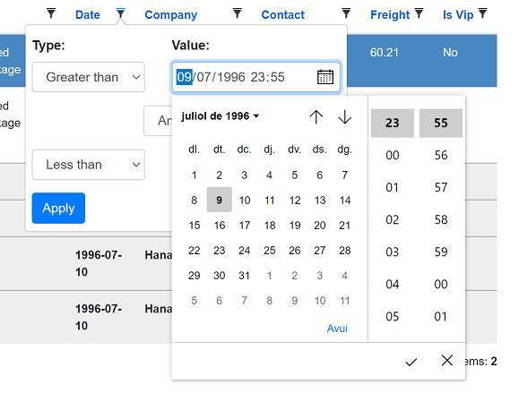
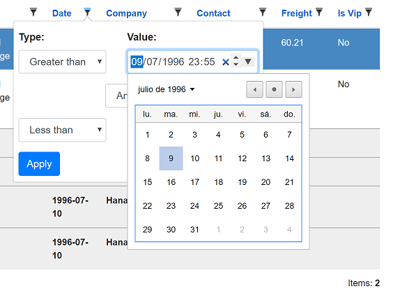
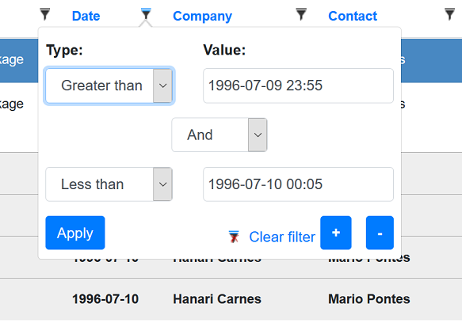

## Blazor WASM with GridCore back-end (gRPC)

# Using a date time filter

[Index](Documentation.md)

The default behavior for a ```DateTime``` column is to use a filter widget that allows only date picking. 

But it's also possible to use other ```DateTime``` formats:
- a date time picker, where users can select year, month, day, hour, and minute info. Seconds are not supported.

    You have to add the column using the ```SetFilterWidgetType``` method of the ```GridColumn``` object using the parameter value "DateTimeLocal" and add the correct column format:

    ```c#
        c.Add(o => o.OrderDate).SetFilterWidgetType("DateTimeLocal").Format("{0:yyyy-MM-dd HH:mm}");
    ``` 

- a week picker, where users can select year and week info.

    You have to add the column using the ```SetFilterWidgetType``` method of the ```GridColumn``` object using the parameter value "Week" and render the value using ```DateTimeUtils.GetWeekDateTimeString```:

    ```c#
        c.Add(o => o.OrderDate).SetFilterWidgetType("Week").RenderValueAs(o => DateTimeUtils.GetWeekDateTimeString(o.OrderDate));
    ``` 

- a month picker, where users can select year and month info.

    You have to add the column using the ```SetFilterWidgetType``` method of the ```GridColumn``` object using the parameter value "Month" and add the correct column format:

    ```c#
        c.Add(o => o.OrderDate).SetFilterWidgetType("Month").Format("{0:yyyy-MM}");
    ``` 

## Date format

Dates are written the way the reader writes them, and travel to the server in ISO 8601
(```yyyy-MM-dd```) whatever the reader's locale. The two are deliberately separate: the order of
day and month is exactly what changes between locales, and reading ```09/01``` as the ninth of
January when it is the first of September is a mistake nothing in the text reveals.

What the reader sees is decided in this order:

1. the column's own format, when it sets one with ```Format```;
2. otherwise the current culture's short date pattern - which in Blazor WebAssembly is the
   browser's - with the day and the month padded to two digits.

The same rule covers grid cells, group rows, totals, the CRUD forms and the filter widgets.
Query strings and filter values never follow it.

A ```DateTime``` shows its **date alone**. Nearly every date column in a grid is a date - an
order date, a birth date, a hire date - and appending ```0:00``` to all of them is noise in
every row to keep the hour legible in the few that carry one. Where the hour matters the column
says so, with ```Format("{0:g}")``` or any pattern spelling both halves. Editing is unaffected:
the CRUD form still edits the whole value.

Where the browser draws the picker itself - an ```<input type="date">``` and its relatives - it
is the browser that renders the value in the reader's locale, so the value in the markup stays
ISO. Only where the browser falls back to a plain text box does the grid write the date itself.

### Who spells the date the reader types

There is one place the grid's culture cannot reach on its own: a native picker. An
```<input type="date">``` carries its value in ISO 8601 by specification, and the browser paints
it in **its own** language - not the page's, and not the culture the grid was given. For an
application that takes its culture from the browser the two agree and there is nothing to do. For
one that chooses its own - with a language selector, say - the filter would read in one format and
the cell below it in another.

```SetDateInputMode``` decides which of the two writes it:

```c#
    var client = new GridClient<Order>(HttpClient, url, query, false, "ordersGrid", columns, locale)
        .SetDateInputMode(DateInputMode.Grid);
```

| | |
|---|---|
| ```DateInputMode.Browser``` | the native picker, with its calendar and its date keyboard on a phone. Reads in the browser's language. The default |
| ```DateInputMode.Grid``` | a text box the grid writes and reads itself, in the culture it was given. Agrees with the cells whatever the browser is set to |

It covers the filters and the CRUD forms alike, and what travels to the server is ISO either way.

### The grid's own pickers

```DateInputMode.Grid``` is not a trade of the calendar for the format. The field it renders
carries a picker of its own, drawn by the grid, so the reader keeps a control and gets it in the
culture the application chose:

| Widget | What opens | Where |
|---|---|---|
| date | a month calendar | ```System.DateTime```, ```System.DateTimeOffset```, ```System.DateOnly``` |
| time | a clock of hours and minutes | ```System.TimeOnly```, ```System.TimeSpan``` |
| datetime-local | calendar and clock side by side | ```SetFilterWidgetType("DateTimeLocal")``` |
| month | a grid of the year's months | ```SetFilterWidgetType("Month")``` |
| week | nothing, deliberately | ```SetFilterWidgetType("Week")``` |

The week picker is missing on purpose: an ISO week number reads ```2026-W36``` in every locale, so
there is nothing for a grid-drawn picker to correct and the native one is left in place.

What the picker draws follows the culture rather than translating a Gregorian month into it:

- the week starts on the day that culture starts it - Monday in Madrid, Sunday in Chicago;
- **the calendar is that culture's calendar**. A Persian reader gets Shahrivar 1405, not September
  2026 with Persian labels: a different month, of a different length, starting on a different day.
  Buddhist, Hijri and Hebrew likewise, the last of which has thirteen months in a leap year, so
  the month grid is not assumed to hold twelve;
- day headings shrink to single letters where the abbreviations are whole words, as in Persian
  and Arabic, and stay as ```lun``` / ```Mon``` where they already fit;
- the clock is twelve-hour with a meridiem column where the culture reads hours that way;
- right-to-left is handled: the popup hangs from the correct edge and the navigation arrows point
  the way that culture reads.

The value the picker writes is still ISO on the wire, and the cell, the filter and the form all
spell it the same way.

What ```DateInputMode.Grid``` does still cost is the **phone's date keyboard**: that belongs to
the native control and cannot be summoned from markup. Read and delete forms are unaffected -
their fields are read-only and were never pickers.

Keyboard, checked against what the component actually handles: ```Escape``` and ```Tab``` close
any popup and return to the field. The calendar takes the four arrow keys, ```PageUp``` and
```PageDown``` for the previous and next month, and ```Enter``` or ```Space``` to pick. A
time-only clock takes the same keys. Two gaps, stated rather than hidden: in a **datetime-local**
the arrows steer the calendar and the clock is reachable with the pointer only - both moving at
once would leave the reader unable to aim either - and the **month** grid has no key navigation
beyond closing.

## Examples

The UI shown by the widget will depend on the browser used:

- Edge Chromium will show a datetime picker:

    

- Chrome and Opera will show a date picker, but time must be selected manually:

    

- Firefox will only allow to write the date and the time manually, in the format the reader reads:

    

[<- Using a list filter](Using_list_filter.md) | [Creating custom filter widget ->](Creating_custom_filter_widget.md)