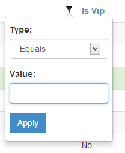
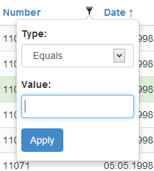
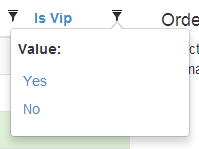
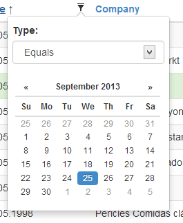
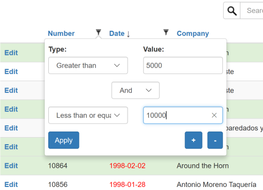

## Blazor WASM with local data

# Filtering

[Index](Documentation.md)

You can enable the filtering option for your columns. To enable this functionality use the **Filterable** method of the **Column** object:

```c#
    Columns.Add(o => o.Customers.CompanyName)
        .Titled("Company Name")
        .Filterable(true)
        .Width(220)
```
After that you can filter this column. 

You can enable filtering for all columns of a grid using the **Filterable** method for both **GridClient** and **GridCoreServer** objects:

* razor page
    ```c#
        var client = new GridClient<Order>(q => orderService.GetOrdersGridRows(columns, q), query, false, "ordersGrid", Columns, locale)
            .Filterable()
    ```

* service method
    ```c#
        var server = new GridCoreServer<Order>(repository.GetAll(), Request.Query, true, "ordersGrid", columns, 10)
            .Filterable()
    ```

You can enable a button to clear all selected filters using the ***ClearFiltersButton*** method of the **GridClient** object:  

```c#
    var client = new GridClient<Order>(q => orderService.GetOrdersGridRows(columns, q), query, false, "ordersGrid", Columns, locale)
        .ClearFiltersButton(true);
```

**GridBlazor** supports several types of columns (specified in the **Add** method):

* System.String
* System.Guid
* System.Int32
* System.Int64
* System.Boolean
* System.DateTime
* System.Decimal
* System.Byte
* System.Double
* System.Single
* enum

It also supports nullable types of any element of the list.

**GridBlazor** has different filter widgets for these types:
* **TextFitlerWidget**: it provides a filter interface for text columns (System.String). This means that if your column has text data, **GridBlazor** will render an specific filter interface:

    

* **NumberFilterWidget**: it provides a filter interface for number columns (System.Int32, System.Decimal etc.)

    

* **BooleanFilterWidget**: it provides a filter interface for boolean columns (System.Boolean):

    

* **DateTimeFilterWidget**: it provides a filter interface for datetime columns (System.DateTime):

    

## Multiple filters

Pressing the **+** and **-** buttons you can add multiple options to filter. You can also select the condition you want to use, either **And** or **Or**:



You can also create your own filter widgets.

# Disable diacritics distinction

GridBlazor distinguishes among letters with diacritics by default. If you filter by the term "bru, it will return all records that contains "bru", but it won't returns any record containing "brú", "brû" or "brü". 

Anyway, it is possible to override the default behavior, so GridBlazor will return any record containing "brú", "brû" or "brü". 

The solution to be implemented in case of data stored locally is as follows:
    1. you must create the following static function with an string parameter and returning an string (other functions removing diacritics are also supported):
        ```c#
            public class StringUtils
            {
 
                ...

                public static string RemoveDiacritics(string text)
                {
                    var normalizedString = text.Normalize(NormalizationForm.FormD);
                    var stringBuilder = new StringBuilder();

                    foreach (var c in normalizedString)
                    {
                        var unicodeCategory = CharUnicodeInfo.GetUnicodeCategory(c);
                        if (unicodeCategory != UnicodeCategory.NonSpacingMark)
                        {
                            stringBuilder.Append(c);
                        }
                    }

                    return stringBuilder.ToString().Normalize(NormalizationForm.FormC);
                }
            }
        ```
    2. and finally you must call the ```SetRemoveDiacritics``` method of the ```GridCoreServer``` class:
        ```c#
            var server = new GridCoreServer<Order>(Orders, query, true, "ordersGrid", columns)
                .Filterable()
                .SetRemoveDiacritics<StringUtils>("RemoveDiacritics");
        ```

[<- Searching](Searching.md) | [Using a list filter ->](Using_list_filter.md)