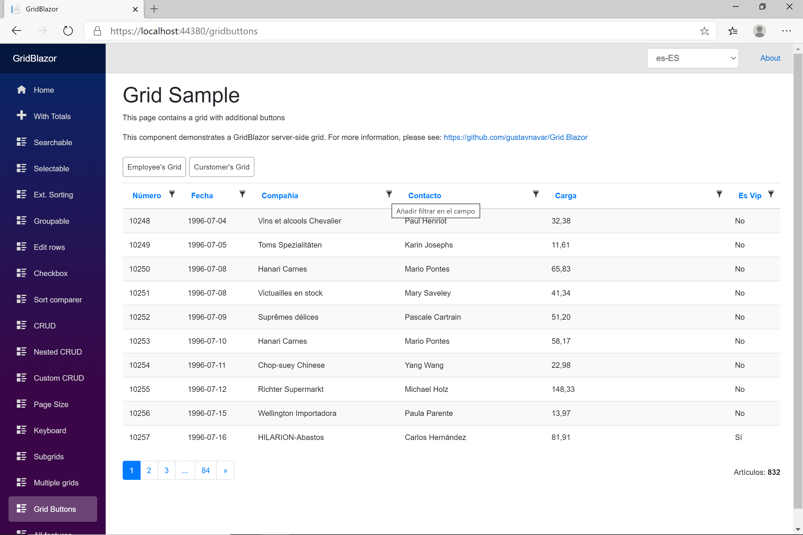

## Blazor client-side with OData back-end

# Button components on the grid

[Index](Documentation.md)

Compoments can be embedded on a grid. These components can be started pushing a button on the top of the grid and will be shown on the screen.

## Page definition

You can use the **AddButtonComponent** method of the **GridODataClient** object to add a component:
```c#
    var client = new GridODataClient<Order>(httpClient, url, query, false, "ordersGrid", columns, 10, locale)
        .AddButtonComponent<EmployeeComponent>("Employees", "Employee's Grid");
```

**AddButtonComponent** method has 3 optional parameters:

Parameter | Type | Description
--------- | ---- | -----------
Actions | IList<Action<object>> (optional) | the parent component can pass a list of Actions to be used by the component
Functions | IList<Func<object,Task>> (optional) | the parent component can pass a list of Functions to be used by the child component
Object | object (optional) | the parent component can pass an object to be used by the component

If you use any of these paramenters, you must use them when creating the component.

## Component definition

You must also create a Blazor component that allows 4 optional parameters:

Parameter | Type | Description
--------- | ---- | -----------
Grid | CGrid<T> (optional) | Grid can be used to get any required information
Actions | IList<Action<object>> (optional) | the parent component can pass a list of Actions to be used by the component
Functions | IList<Func<object,Task>> (optional) | the parent component can pass a list of Functions to be used by the child component
Object | object (optional) | the parent component can pass an object to be used by the component

**Actions**, **Functions** and **Object** must be used when calling the **AddButtonComponent** method, but **Grid** can be used without this requirement.
 
The component can include any html elements as well as any event handling features.

This is an example of a grid with 2 additional components:




[<- Events](Events.md)