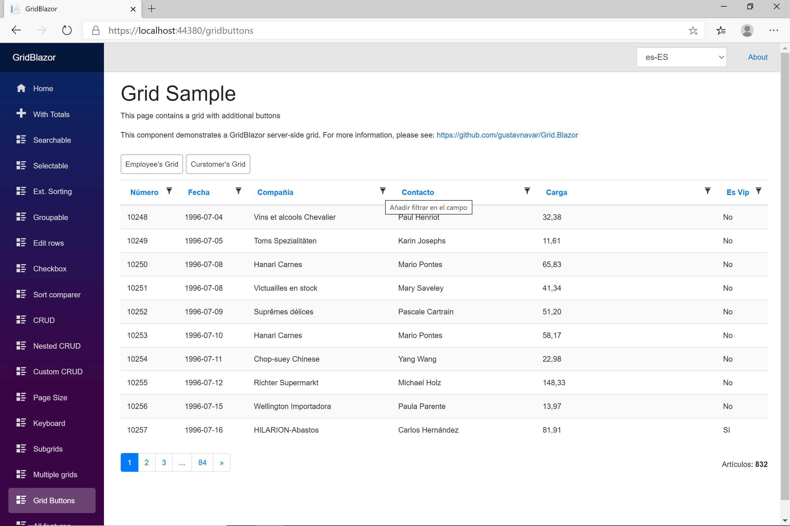
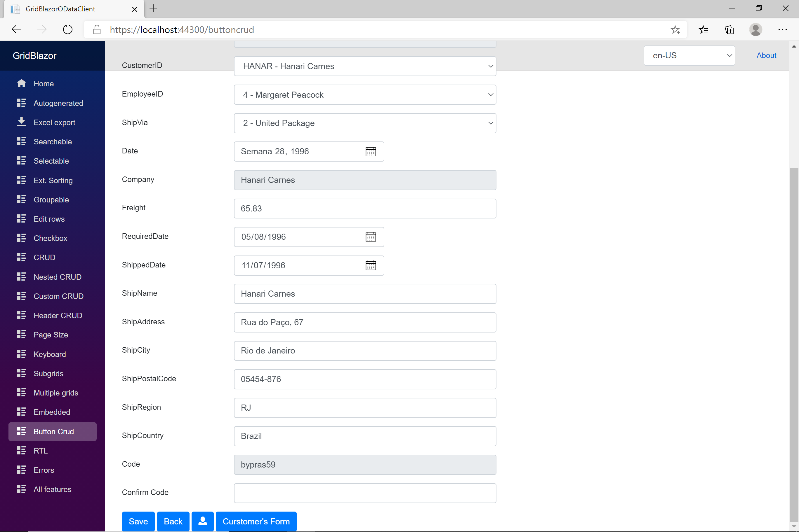

## Blazor WASM with OData back-end

# Button components on a grid and on CRUD forms

[Index](Documentation.md)

Compoments can be embedded on a grid and/or on CRUD forms. 

## Button components on a grid
These components can be started clicking on a button on the top of the grid or in the grid columns. On both cases they will be shown on the screen instead of the grid.

### Page definition

* If you want to use a button on the top of the grid to start the embedded component, you can use the **AddButtonComponent** method of the **GridODataClient** object to add a component:
    
    ```c#
        var client = new GridODataClient<Order>(httpClient, url, query, false, "ordersGrid", Columns, locale)
            .AddButtonComponent<EmployeeComponent>("Employees", "Employee's Grid");
    ```

    **AddButtonComponent** method has 2 required parameter and 4 optional ones:

    Parameter | Type | Description
    --------- | ---- | -----------
    Name | string | unique name in the grid to identify the embedded component
    Label | string | label to be shown in the button
    Content | MarkupString (optional) | html content to be shown in the button
    Actions | IList<Action<object>> (optional) | the parent component can pass a list of Actions to be used by the component
    Functions | IList<Func<object,Task>> (optional) | the parent component can pass a list of Functions to be used by the child component
    Object | object (optional) | the parent component can pass an object to be used by the component

    If you use any of these parameters, you must use them when creating the component.

* If you want to use a button in a grid column to start the embedded component, you has to render a button in a grid cell custom column:
    
    ```c#
        c.Add().Encoded(false).Sanitized(false).RenderComponentAs<ShipperButtonCell>();
    ```
    You can use any option described in the [documentation](Render_button_checkbox_etc_in_a_grid_cell.md)

    This button component has 2 specific requirements:
    - It must implement the ```ICustomGridComponent<T>``` interface. 
    - It must start the embedded component using the ```StartFormComponent<TFormComponent>``` method of the parent ```GridComponent```.
    
    The ```StartFormComponent<TFormComponent>``` method has 1 required parameter and 3 optional ones:

    Parameter | Type | Description
    --------- | ---- | -----------
    Label| string | label to be shown on the screen
    Actions | IList<Action<object>> (optional) | the parent component can pass a list of Actions to be used by the component
    Functions | IList<Func<object,Task>> (optional) | the parent component can pass a list of Functions to be used by the child component
    Object | object (optional) | the parent component can pass an object to be used by the component

    This is an example for ```ShipperButtonCell```:
    ```c#
        @implements ICustomGridComponent<Order>

        @if (Item.Shipper != null)
        {
            <button class='btn btn-sm btn-primary' @onclick="MyClickHandler">View Shipper</button>
        }

        @code {

            [CascadingParameter(Name = "GridComponent")]
            public GridComponent<Order> GridComponent { get; set; }

            [Parameter]
            public Order Item { get; set; }

            private void MyClickHandler(MouseEventArgs e)
            {
                GridComponent.StartFormComponent<ShipperComponent>("Shipper Information", null, null, Item.Shipper);
            }
        }
    ```

### Component definition

You must also create the Blazor component that you want to embed. The 5 optional parameters are allowed:

Parameter | Type | Description
--------- | ---- | -----------
GridComponent | GridComponent<T> (optional) | Cascading parameter to access the parent component
Grid | CGrid<T> (optional) | Grid can be used to get any required information
Actions | IList<Action<object>> (optional) | the parent component can pass a list of Actions to be used by the component
Functions | IList<Func<object,Task>> (optional) | the parent component can pass a list of Functions to be used by the child component
Object | object (optional) | the parent component can pass an object to be used by the component

**Actions**, **Functions** and **Object** must be used when calling the **AddButtonComponent** method, but **Grid** can be used without this requirement.
 
The component can include any html elements as well as any event handling features.

This is an example of a grid with 2 additional components:




## Button components on CRUD forms
These type of components can be started clicking on a button on the bottom of a CRUD form.

### Page definition

You have to use the **AddCrudButtonComponent** method of the **GridODataClient** object to add a component. 

There are 3 options:

* Use booleans to enable buttons:
    ```c#
        var client = new GridODataClient<Order>(httpClient, url, query, false, "ordersGrid", Columns, locale)
            .ODataCrud(true)
            .AddButtonCrudComponent<EmployeeFormComponent>("Employees", "Employee's Grid", true, true, true, true);
    ```

    **AddCrudButtonComponent** method has 6 required parameters and 4 optional ones:

    Parameter | Type | Description
    --------- | ---- | -----------
    Name | string | unique name in the grid to identify the embedded component
    Label | string | label to be shown in the button
    CreateEnabled |bool | enables the button component on the Create form
    ReadEnabled | bool |  enables the button component on the Read form
    UpdateEnabled | bool | enables the button component on the Update form
    DeleteEnabled | bool | enables the button component on the Delete form
    Content | MarkupString (optional) | html content to be shown in the button
    Actions | IList<Action<object>> (optional) | the parent component can pass a list of Actions to be used by the component
    Functions | IList<Func<object,Task>> (optional) | the parent component can pass a list of Functions to be used by the child component
    Object | object (optional) | the parent component can pass an object to be used by the component

* Use functions to enable buttons:
    ```c#
        var client = new GridODataClient<Order>(httpClient, url, query, false, "ordersGrid", Columns, locale)
            .ODataCrud(true)
            .AddButtonCrudComponent<EmployeeFormComponent>("Employees", "Employee's Grid", true, r => r.EmployeeID > 10, r => r.EmployeeID > 10, r => r.EmployeeID > 10);
    ```

    **AddCrudButtonComponent** method has 6 required parameters and 4 optional ones:

    Parameter | Type | Description
    --------- | ---- | -----------
    Name | string | unique name in the grid to identify the embedded component
    Label | string | label to be shown in the button
    CreateEnabled |bool | enables the button component on the Create form
    ReadEnabled | Func<T, bool> |  function returning a boolean to enable the button component on the Read form
    UpdateEnabled | Func<T, bool> | function returning a boolean to enable the button component on the Update form
    DeleteEnabled | Func<T, bool> | function returning a boolean to enable the button component on the Delete form
    Content | MarkupString (optional) | html content to be shown in the button
    Actions | IList<Action<object>> (optional) | the parent component can pass a list of Actions to be used by the component
    Functions | IList<Func<object,Task>> (optional) | the parent component can pass a list of Functions to be used by the child component
    Object | object (optional) | the parent component can pass an object to be used by the component

* Use functions returning a Task<bool> to enable buttons:

    **AddCrudButtonComponent** method has 6 required parameters and 4 optional ones:

    Parameter | Type | Description
    --------- | ---- | -----------
    Name | string | unique name in the grid to identify the embedded component
    Label | string | label to be shown in the button
    CreateEnabled |bool | enables the button component on the Create form
    ReadEnabled | Func<T, Task<bool>> |  function returning a Task<bool> to enable the button component on the Read form
    UpdateEnabled | Func<T, Task<bool>> | function returning a Task<bool> to enable the button component on the Update form
    DeleteEnabled | Func<T, Task<bool>> | function returning a Task<bool> to enable the button component on the Delete form
    Content | MarkupString (optional) | html content to be shown in the button
    Actions | IList<Action<object>> (optional) | the parent component can pass a list of Actions to be used by the component
    Functions | IList<Func<object,Task>> (optional) | the parent component can pass a list of Functions to be used by the child component
    Object | object (optional) | the parent component can pass an object to be used by the component

### Component definition

You must also create the Blazor component that you want to embed. It must implement the ```IFormCrudComponent<T>``` interface. There are 2 parameters required by this interface:
Parameter | Type | Description
--------- | ---- | -----------
Item | T | Model of the parent CRUD form
ReturnMode | GridMode | Mode of the grid to be shown when the components returns

And there are 5 optional parameters:
Parameter | Type | Description
--------- | ---- | -----------
GridComponent | GridComponent<T> (optional) | Cascading parameter to access the parent component
Grid | CGrid<T> (optional) | Grid can be used to get any required information
Actions | IList<Action<object>> (optional) | the parent component can pass a list of Actions to be used by the component
Functions | IList<Func<object,Task>> (optional) | the parent component can pass a list of Functions to be used by the child component
Object | object (optional) | the parent component can pass an object to be used by the component

**Actions**, **Functions** and **Object** must be used when calling the **AddButtonCrudComponent** method, but **Grid** can be used without this requirement.
 
The component can include any html elements as well as any event handling features.

This is an example of component:
    ```c#
        @implements IFormCrudComponent<Order>
        @inject NavigationManager NavigationManager
        @inject HttpClient HttpClient

        <div class="@GridComponent.GridCrudHeaderCssClass">Customer</div>

        @if (_customer == null)
        {
            <p><em>Loading...</em></p>
        }
        else
        {
            <div class="form-horizontal">
                <div class="form-group row">
                    <label class="col-form-label col-md-2">CustomerID</label>
                    <div class="col-md-5">
                        <input class="form-control" readonly="readonly" value="@_customer.CustomerID" />
                    </div>
                </div>

                <div class="form-group row">
                    <label class="col-form-label col-md-2">Company Name</label>
                    <div class="col-md-5">
                        <input class="form-control" readonly="readonly" value="@_customer.CompanyName" />
                    </div>
                </div>

                <div class="form-group row">
                    <label class="col-form-label col-md-2">Contact Name</label>
                    <div class="col-md-5">
                        <input class="form-control" readonly="readonly" value="@_customer.ContactName" />
                    </div>
                </div>

                <div class="form-group row">
                    <label class="col-form-label col-md-2">Country</label>
                    <div class="col-md-5">
                        <input class="form-control" readonly="readonly" value="@_customer.Country" />
                    </div>
                </div>
        
                <div style="display:flex;">
                    <div>
                        <button type="button" class="btn btn-primary btn-md" @onclick="() => BackButtonClicked()">Back</button>
                    </div>
                </div>
            </div>
        }

        @code {
            private Customer _customer;

            [CascadingParameter(Name = "GridComponent")]
            protected GridComponent<Order> GridComponent { get; set; }

            [Parameter]
            public Order Item { get; set; }

            [Parameter]
            public GridMode ReturnMode { get; set; }

            protected override async Task OnParametersSetAsync()
            {
                if (string.IsNullOrWhiteSpace(Item.CustomerID))
                    await BackButtonClicked();
                else
                {
                    string url = NavigationManager.BaseUri + $"odata/Customers/{Item.CustomerID}";
                    _customer = await HttpClient.GetFromJsonAsync<Customer>(url);
                }
            }

            protected async Task BackButtonClicked()
            {
                if (ReturnMode == GridMode.Create)
                    await GridComponent.CreateHandler(Item);
                else if (ReturnMode == GridMode.Read)
                    await GridComponent.ReadHandler(Item);
                else if (ReturnMode == GridMode.Update)
                    await GridComponent.UpdateHandler(Item);
                else if (ReturnMode == GridMode.Delete)
                    await GridComponent.DeleteHandler(Item);
                else
                    await GridComponent.Back();
            }
        }
    ```




[<- Events](Events.md) | [Export to Excel ->](Excel_export.md)