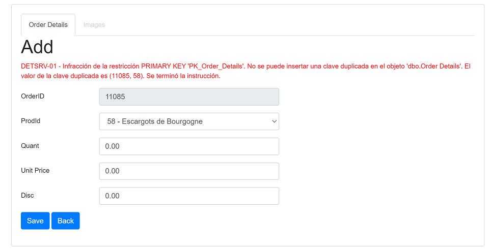

## Blazor WASM with OData back-end

# Events, exceptions and CRUD validation

[Index](Documentation.md)

## Events and CRUD validation

GridBlazor component provides some events to notify other classes or objects when the grid has changed. The supported events are:
- ```Func<object, PagerEventArgs, Task> PagerChanged```: it's fired when the page number and/or page size are changed 
- ```Func<object, SortEventArgs, Task> SortChanged```: it's fired when sorting is changed 
- ```Func<object, ExtSortEventArgs, Task> ExtSortChanged```: it's fired when extended sorting or grouping are changed
- ```Func<object, FilterEventArgs, Task<bool>> BeforeFilterChanged```: it's fired before a filter is created, changed or removed
- ```Func<object, FilterEventArgs, Task> FilterChanged```: it's fired when a filter is created, changed or removed
- ```Func<object, SearchEventArgs, Task> SearchChanged```: it's fired when the a new word is searched or search has been cleared 

These events are provided to allow running tasks while opening and closing (only pressing the Back button, but not when saving items) CRUD forms:
- ```Func<GridComponent<T>, T, Task<bool>> BeforeCreateForm```: it's fired when the Add button to open a Create form is pressed
- ```Func<GridComponent<T>, T, Task> AfterCreateForm```: it's fired after the Add button to open a Create form is pressed 
- ```Func<GridComponent<T>, T, Task<bool>> BeforeReadForm```: it's fired when the View button to open a Read form is pressed
- ```Func<GridComponent<T>, T, Task> AfterReadForm```: it's fired after the Wiew button to open a Read form is pressed 
- ```Func<GridComponent<T>, T, Task<bool>> BeforeUpdateForm```: it's fired when the Edit button to open a Update form is pressed
- ```Func<GridComponent<T>, T, Task> AfterUpdateForm```: it's fired after the Edit button to open a Update form is pressed 
- ```Func<GridComponent<T>, T, Task<bool>> BeforeDeleteForm```: it's fired when the button to open a Delete form is pressed
- ```Func<GridComponent<T>, T, Task> AfterDeleteForm```: it's fired after the button to open a Delete form is pressed 
- ```Func<GridComponent<T>, T, Task<bool>> BeforeBack```: it's fired when the Back button of a CRUD form is pressed
- ```Func<GridComponent<T>, T, Task> AfterBack```: it's fired after the Back button of a CRUD form is pressed 

These events are provided to allow running tasks on changing grid items:
- ```Func<GridCreateComponent<T>, T, Task<bool>> BeforeInsert```: it's fired before an item is inserted
- ```Func<GridCreateComponent<T>, T, Task<bool>> BeforeUpdate```: it's fired before an item is updated
- ```Func<GridCreateComponent<T>, T, Task<bool>> BeforeDelete```: it's fired before an item is deleted
- ```Func<GridCreateComponent<T>, T, Task> AfterInsert```: it's fired after an item is inserted
- ```Func<GridCreateComponent<T>, T, Task> AfterUpdate```: it's fired after an item is updated
- ```Func<GridCreateComponent<T>, T, Task> AfterDelete```: it's fired after an item is deleted

These events are provided to allow running tasks on changing [Checkbox columns](Selecting_row.md#setcheckboxcolumn-method) :
- ```Func<CheckboxEventArgs<T>, Task> HeaderCheckboxChanged```: it's fired when a header checkbox is changed
- ```Func<CheckboxEventArgs<T>, Task> RowCheckboxChanged```: it's fired when a row checkbox is changed

And these events are provided to allow running tasks before and after grid is refreshed:
- ```Func<Task> BeforeRefreshGrid```: it's fired before the grid will be refreshed
- ```Func<Task> AfterRefreshGrid```: it's fired after the grid is refreshed 

If you want to handle an event you have to create a reference to the ```GridCompoment```. 

The ```GridCompoment``` object has an attribute named ```Error``` that can be set to show an error on the CRUD form.
There is also another property named ```ColumnErrors``` to show errors specific to each each form field. ```ColumnErrors``` is a ```QueryDictionary``` to store the error message for each field.

Then you have to add the events that you want to handle in the ```OnAfterRender``` method.

And finally you have to write the handlers for each event.

You can see here an example handling all component events that writes some grid changes on the console and validates a grid item before being inserted, updated and deleted:

```c#
    <GridComponent @ref="_gridComponent" T="Order" Grid="@_grid"></GridComponent>

    @code
    {
        private GridComponent<Order> _gridComponent;
        private bool _areEventsLoaded = false;
        ...

        protected override void OnAfterRender(bool firstRender)
        {
            if (!_areEventsLoaded && _gridComponent != null)
            {
                _gridComponent.PagerChanged += PagerChanged;
                _gridComponent.SortChanged += SortChanged;
                _gridComponent.ExtSortChanged += ExtSortChanged;
                _gridComponent.BeforeFilterChanged += BeforeFilterChanged;
                _gridComponent.FilterChanged += FilterChanged;
                _gridComponent.SearchChanged += SearchChanged;

                _gridComponent.BeforeInsert += BeforeInsert;
                _gridComponent.BeforeUpdate += BeforeUpdate;
                _gridComponent.BeforeDelete += BeforeDelete;

                _gridComponent.BeforeRefreshGrid += BeforeRefreshGrid;
                _gridComponent.AfterRefreshGrid += AfterRefreshGrid;

                _areEventsLoaded = true;
            }
        }

        private async Task PagerChanged(object sender, PagerEventArgs e)
        {
            Console.WriteLine("The pager has changed: EnablePaging: {0}, CurrentPage: {1}, ItemsCount: {2}, PageSize: {3}.",
                e.Pager.EnablePaging, e.Pager.CurrentPage, e.Pager.ItemsCount, e.Pager.PageSize);
            await Task.CompletedTask;
        }

        private async Task SortChanged(object sender, SortEventArgs e)
        {
            Console.WriteLine("Sorting has changed: ColumnName: {0}, Direction: {1}.",
                e.ColumnName, e.Direction);
            await Task.CompletedTask;
        }

        private async Task ExtSortChanged(object sender, ExtSortEventArgs e)
        {
            Console.WriteLine("Extended sorting has changed:");
            foreach (var sortValues in e.SortValues)
            {
                Console.WriteLine(" - ColumnName: {0}, Direction: {1}, Id: {2}.",
                    sortValues.ColumnName, sortValues.Direction, sortValues.Id);
            }
            await Task.CompletedTask;
        }

        private async Task<bool> BeforeFilterChanged(object sender, FilterEventArgs e)
        {
            Console.WriteLine("Filters can be changed:");
            foreach (var filteredColumn in e.FilteredColumns)
            {
                Console.WriteLine(" - ColumnName: {0}, FilterType: {1}, FilterValue: {2}.",
                    filteredColumn.ColumnName, filteredColumn.FilterType, filteredColumn.FilterValue);
            }
            await Task.CompletedTask;
            var rnd = new Random();
            if (rnd.Next(100) % 2 == 0)
            {
                Console.WriteLine("Filters will be changed");
                return true;
            }
            else
            {
                Console.WriteLine("Filters won't be changed");
                return false;
            }
        }
        
        private async Task FilterChanged(object sender, FilterEventArgs e)
        {
            Console.WriteLine("Filters have changed:");
            foreach (var filteredColumn in e.FilteredColumns)
            {
                Console.WriteLine(" - ColumnName: {0}, FilterType: {1}, FilterValue: {2}.",
                    filteredColumn.ColumnName, filteredColumn.FilterType, filteredColumn.FilterValue);
            }
            await Task.CompletedTask;
        }

        private async Task SearchChanged(object sender, SearchEventArgs e)
        {
            Console.WriteLine("Search has changed: SearchValue: {0}.", e.SearchValue);
            await Task.CompletedTask;
        }

        private async Task<bool> BeforeInsert(GridCreateComponent<Order> component, Order item)
        {
            var orderValidator = new OrderValidator();
            var valid = await orderValidator.ValidateAsync(item);

            if (!valid.IsValid)
            {
                component.Error = "Insert operation returned one or more errors";
                foreach (var error in valid.Errors)
                {
                    component.ColumnErrors.AddParameter(error.PropertyName, error.ErrorMessage);
                }
            }

            return valid.IsValid;
        }

        private async Task<bool> BeforeUpdate(GridUpdateComponent<Order> component, Order item)
        {
            var orderValidator = new OrderValidator();
            var valid = await orderValidator.ValidateAsync(item);

            if (!valid.IsValid)
            {
                component.Error = "Update operation returned one or more errors";
                foreach (var error in valid.Errors)
                {
                    component.ColumnErrors.AddParameter(error.PropertyName, error.ErrorMessage);
                }
            }

            return valid.IsValid;
        }

        private async Task<bool> BeforeDelete(GridDeleteComponent<Order> component, Order item)
        {
            var orderValidator = new OrderValidator();
            var valid = await orderValidator.ValidateAsync(item);

            if (!valid.IsValid)
            {
                component.Error = valid.ToString();
            }

            return valid.IsValid;
        }
        
        private async Task<bool> BeforeRefreshGrid()
        {
            Console.WriteLine("Grid will start refreshing");
            await Task.CompletedTask;
            return true;
        }

        private async Task AfterRefreshGrid()
        {
            Console.WriteLine("Grid has been refreshed");
            await Task.CompletedTask;
        }
    }
```

Notice that all handlers must be async. 

In this sample ```OrderValidator``` is a class that validates the ```Order``` object to be modified. If it's a valid item the event returns ```true```.  If the item is not valid the event writes an error on the form and returns ```false```. 


## Grid column events

Grid column provides an event to notify when a column is changed in the standard Create and Update forms. The supported event is:
- ```Func<T, GridMode, Task> AfterChangeValue```: it's fired when the column value is changed 

This column event is configured using the ```SetAfterChangeValue``` of the ```GridColumn``` object.

You can see here an example of the grid column definition where the method ```afterChangeCustomerID``` is fired when a new value of the ```CusotmerID``` is selected:

```c#
c.Add(o => o.CustomerID)
    .SetSelectField(true, o => o.Customer.CustomerID + " - " + o.Customer.CompanyName, o => path + $"api/SampleData/GetAllCustomers")
    .SetAfterChangeValue(afterChangeCustomerID);
```

The fired method can do any change on the row. You can see here an example where the ```OrderDate``` field is modified only on the Create form:

```c#
Func<Order, GridMode, Task> afterChangeCustomerID = async (order, mode) =>
{
    if (mode == GridMode.Create)
    {
        order.OrderDate = DateTime.Now;
        StateHasChanged();
        await Task.CompletedTask;
    }
};
```


## Default CRUD data annotations validation

GridBlazor validates by default all data annotations defined with attributes on the the model. This validation happens for Create and Update standard forms. If you use custom CRUD forms this will depend on your code.

If you want to use custom validator classes on standard CRUD form, you can disable the default data annotation validation to avoid validators collisions. 
It can be disabled using the ```SetDataAnnotationsValidation``` method of the ```GridClient``` object.
An then you have to configure your custom validators using the  ```BeforeInsert```, ```BeforeUpdate``` and ```BeforeDelete``` events.


## Events for subgrids and nested CRUD subgrids

If you want to define events for a subgrid and/or a nested CRUD subgrid you must handle in the ```OnAfterRender``` method of the subgrid component. 
The ```AddToOnAfterRender``` method of the ```GridClient``` object allows to define those events for subgrids

```c#
<GridComponent @ref="_gridComponent" T="Order" Grid="@_grid"></GridComponent>

@code
{
    private GridComponent<Order> _gridComponent;
    ...

    protected override async Task OnParametersSetAsync()
    {
        var locale = CultureInfo.CurrentCulture;

        Func<object[], bool, bool, bool, bool, Task<IGrid>> subgrids = async (keys, create, read, update, delete) =>
        {
            var subGridQuery = new QueryDictionary<StringValues>();

            Action<IGridColumnCollection<OrderDetail>, string> subgridColumns = (c, baseUri) =>
            {
                c.Add(o => o.OrderID, true).SetPrimaryKey(true).SetWidth(100);
                c.Add(o => o.ProductID).SetPrimaryKey(true).Titled("ProdId").SetWidth(100).SetSelectField(true, o => o.Product.ProductID.ToString() + " - " + o.Product.ProductName, () => GetAllProducts(baseUri));
                c.Add(o => o.Product.ProductName).Titled("ProdName").SetCrudHidden(true).SetWidth(250);
                c.Add(o => o.Quantity).Titled("Quant").SetWidth(100).Format("{0:F}");
                c.Add(o => o.UnitPrice).Titled("Unit Price").SetWidth(100).Format("{0:F}");
                c.Add(o => o.Discount).Titled("Disc").SetWidth(100).Format("{0:F}");
            };

            string subgridUrl = NavigationManager.BaseUri + $"odata/Orders({keys[0].ToString()})/OrderDetails";
            var subgridClient = new GridODataClient<OrderDetail>(HttpClient, subgridUrl, subGridQuery, false,
                "orderDetailsGrid" + keys[0].ToString(), c => subgridColumns(c, NavigationManager.BaseUri), 10, locale)
                    .Sortable()
                    .Filterable()
                    .SetStriped(true)
                    .ODataCrud(create, read, update, delete)
                    .WithMultipleFilters()
                    .WithGridItemsCount()
                    .AddToOnAfterRender(OnAfterOrderDetailRender);

            await subgridClient.UpdateGrid();
            return subgridClient.Grid;
        };

        var query = new QueryDictionary<StringValues>();

        Action<IGridColumnCollection<Order>, string> columns = (c, baseUri) =>
        {
            c.Add(o => o.OrderID).SetPrimaryKey(true).Titled(SharedResource.Number).SetTooltip("Order ID is ... ").SetWidth(100);
            c.Add(o => o.CustomerID, true).SetSelectField(true, o => o.Customer.CustomerID + " - " + o.Customer.CompanyName, () => GetAllCustomers(baseUri));
            c.Add(o => o.EmployeeID, true).SetSelectField(true, o => o.Employee.EmployeeID.ToString() + " - " + o.Employee.FirstName + " " + o.Employee.LastName, () => GetAllEmployees(baseUri));
            c.Add(o => o.ShipVia, true).SetSelectField(true, o => o.Shipper == null ? "" : o.Shipper.ShipperID.ToString() + " - " + o.Shipper.CompanyName, () => GetAllShippers(baseUri));
            c.Add(o => o.OrderDate, "OrderCustomDate").Titled(SharedResource.OrderCustomDate).SetInputType(InputType.Month).SetFilterWidgetType("Month").Format("{0:yyyy-MM}").SetWidth(120);
            c.Add(o => o.Customer.CompanyName).Titled(SharedResource.CompanyName).SetWidth(250).SetCrudHidden(true).SetReadOnlyOnUpdate(true);
            c.Add(o => o.Customer.ContactName).Titled(SharedResource.ContactName).SetCrudHidden(true);
            c.Add(o => o.Freight).Titled(SharedResource.Freight).SetWidth(150).Format("{0:F}");
            c.Add(o => o.Customer.IsVip).Titled(SharedResource.IsVip).SetWidth(90).Css("hidden-xs").RenderValueAs(o => o.Customer.IsVip ? Strings.BoolTrueLabel : Strings.BoolFalseLabel).SetCrudHidden(true);
            c.Add(o => o.RequiredDate, true).Format("{0:yyyy-MM-dd}");
            c.Add(o => o.ShippedDate, true).Format("{0:yyyy-MM-dd}");
            c.Add(o => o.ShipName, true);
            c.Add(o => o.ShipAddress, true);
            c.Add(o => o.ShipCity, true);
            c.Add(o => o.ShipPostalCode, true);
            c.Add(o => o.ShipRegion, true);
            c.Add(o => o.ShipCountry, true);
            c.Add(o => o.OrderDetails).Titled("Order Details").SubGrid(subgrids, ("OrderID", "OrderID"));
        };

        string url = NavigationManager.BaseUri + "odata/Orders";
        var client = new GridODataClient<Order>(HttpClient, url, query, false, "ordersGrid",
            c => columns(c, NavigationManager.BaseUri), 10, locale, new List<string> { "Employee", "Shipper" })
                .Sortable()
                .Filterable()
                .SetStriped(true)
                .ODataCrud(true)
                .WithMultipleFilters()
                .WithGridItemsCount();

        _grid = client.Grid;

        // Set new items to grid
        _task = client.UpdateGrid();
        await _task;
    }

    Func<string, Task<IEnumerable<SelectItem>>> GetAllCustomers = async (baseUri) =>
    {
        string url = baseUri + $"odata/Customers?$select=CustomerID,CompanyName";
        ODataDTO<Customer> response = await new HttpClient().GetFromJsonAsync<ODataDTO<Customer>>(url);
        if (response == null || response.Value == null)
        {
            return new List<SelectItem>();
        }
        else
        {
            return response.Value
                .Select(r => new SelectItem(r.CustomerID, r.CustomerID + " - " + r.CompanyName))
                .ToList();
        }
    };

    Func<string, Task<IEnumerable<SelectItem>>> GetAllEmployees = async (baseUri) =>
    {
        string url = baseUri + $"odata/Employees?$select=EmployeeID,FirstName,LastName";
        ODataDTO<Employee> response = await new HttpClient().GetFromJsonAsync<ODataDTO<Employee>>(url);
        if (response == null || response.Value == null)
        {
            return new List<SelectItem>();
        }
        else
        {
            return response.Value
                .Select(r => new SelectItem(r.EmployeeID.ToString(), r.EmployeeID.ToString() + " - " + r.FirstName + " " + r.LastName))
                .ToList();
        }
    };

    Func<string, Task<IEnumerable<SelectItem>>> GetAllShippers = async (baseUri) =>
    {
        string url = baseUri + $"odata/Shippers?$select=ShipperID,CompanyName";
        ODataDTO<Shipper> response = await new HttpClient().GetFromJsonAsync<ODataDTO<Shipper>>(url);
        if (response == null || response.Value == null)
        {
            return new List<SelectItem>();
        }
        else
        {
            return response.Value
                .Select(r => new SelectItem(r.ShipperID.ToString(), r.ShipperID.ToString() + " - " + r.CompanyName))
                .ToList();
        }
    };

    Func<string, Task<IEnumerable<SelectItem>>> GetAllProducts = async (baseUri) =>
    {
        string url = baseUri + $"odata/Products?$select=ProductID,ProductName";
        ODataDTO<Product> response = await new HttpClient().GetFromJsonAsync<ODataDTO<Product>>(url);
        if (response == null || response.Value == null)
        {
            return new List<SelectItem>();
        }
        else
        {
            return response.Value
                .Select(r => new SelectItem(r.ProductID.ToString(), r.ProductID.ToString() + " - " + r.ProductName))
                .ToList();
        }
    };

    protected override void OnAfterRender(bool firstRender)
    {
        if (_gridComponent != null && !_areEventsLoaded)
        {
            _gridComponent.BeforeInsert += BeforeInsert;
            _gridComponent.BeforeUpdate += BeforeUpdate;
            _gridComponent.BeforeDelete += BeforeDelete;
            _areEventsLoaded = true;
        }
    }

    private async Task<bool> BeforeInsert(GridCreateComponent<Order> component, Order item)
    {
        var orderValidator = new OrderValidator();
        var valid = await orderValidator.ValidateAsync(item);

        if (!valid.IsValid)
        {
            component.Error = "Insert operation returned one or more errors";
            foreach (var error in valid.Errors)
            {
                component.ColumnErrors.AddParameter(error.PropertyName, error.ErrorMessage);
            }
        }

        return valid.IsValid;
    }

    private async Task<bool> BeforeUpdate(GridUpdateComponent<Order> component, Order item)
    {
        var orderValidator = new OrderValidator();
        var valid = await orderValidator.ValidateAsync(item);

        if (!valid.IsValid)
        {
            component.Error = "Update operation returned one or more errors";
            foreach (var error in valid.Errors)
            {
                component.ColumnErrors.AddParameter(error.PropertyName, error.ErrorMessage);
            }
        }

        return valid.IsValid;
    }

    private async Task<bool> BeforeDelete(GridDeleteComponent<Order> component, Order item)
    {
        var orderValidator = new OrderValidator();
        var valid = await orderValidator.ValidateAsync(item);

        if (!valid.IsValid)
        {
            component.Error = valid.ToString();
        }

        return valid.IsValid;
    }

    private async Task OnAfterOrderDetailRender(GridComponent<OrderDetail> gridComponent, bool firstRender)
    {
        if (firstRender)
        {
            gridComponent.BeforeInsert += BeforeInsertOrderDetail;
            gridComponent.BeforeUpdate += BeforeUpdateOrderDetail;
            gridComponent.BeforeDelete += BeforeDeleteOrderDetail;

            await Task.CompletedTask;
        }
    }

    private async Task<bool> BeforeInsertOrderDetail(GridCreateComponent<OrderDetail> component, OrderDetail item)
    {
        var orderDetailValidator = new OrderDetailValidator();
        var valid = await orderDetailValidator.ValidateAsync(item);

        if (!valid.IsValid)
        {
            component.Error = "Insert operation returned one or more errors";
            foreach (var error in valid.Errors)
            {
                component.ColumnErrors.AddParameter(error.PropertyName, error.ErrorMessage);
            }
        }

        return valid.IsValid;
    }

    private async Task<bool> BeforeUpdateOrderDetail(GridUpdateComponent<OrderDetail> component, OrderDetail item)
    {
        var orderDetailValidator = new OrderDetailValidator();
        var valid = await orderDetailValidator.ValidateAsync(item);

        if (!valid.IsValid)
        {
            component.Error = "Update operation returned one or more errors";
            foreach (var error in valid.Errors)
            {
                component.ColumnErrors.AddParameter(error.PropertyName, error.ErrorMessage);
            }
        }

        return valid.IsValid;
    }

    private async Task<bool> BeforeDeleteOrderDetail(GridDeleteComponent<OrderDetail> component, OrderDetail item)
    {
        var orderDetailValidator = new OrderDetailValidator();
        var valid = await orderDetailValidator.ValidateAsync(item);

        if (!valid.IsValid)
        {
            component.Error = valid.ToString();
        }

        return valid.IsValid;
    }
}
```


## Exceptions and messages on the CRUD forms

```GridException``` is provided to throw exceptions from the ```ICrudDataService<T>``` services used for data persistence. The ```GridException``` message will be shown on the CRUD forms.


You can see here an example catching any exception issued during database insert and throwing a new ```GridException``` with a custom message:
```c#
    public async Task Insert(OrderDetail item)
    {
        using (var context = new NorthwindDbContext(_options))
        {
            try
            {
                var repository = new OrderDetailsRepository(context);
                await repository.Insert(item);
                repository.Save();
            }
            catch (Exception e)
            {
                throw new GridException("There was an error during the order detail record creation");
            }
        }
    }

```

You can also throw a ```GridException``` that will show the most inner exception's message on the CRUD form:
```c#
    public async Task Insert(OrderDetail item)
    {
        using (var context = new NorthwindDbContext(_options))
        {
            try
            {
                var repository = new OrderDetailsRepository(context);
                await repository.Insert(item);
                repository.Save();
            }
            catch (Exception e)
            {
                throw new GridException(e);
            }
        }
    }

```

This is an example of a CRUD form error:



## Handle exceptions from the server

When the ```Grid``` receives data from the server and gets an HTTP error, the default behavior is to capture the exception and write the error on the console.
In this case the client shows an epmty grid, but no error is shown to the user.

There are 2 additional behaviors that can be configured using 2 boolean parameters of the ```HandleServerErrors``` method of the ```GridODataClient```:

Parameter | Description | Example
--------- | ----------- | -------
bool showOnGrid | A message is shown on the top of the grid component | HandleServerErrors(true, false) 
bool throwExceptions | An exception is thrown that has to be captured by your code. In this case you can write the exception on a log or show a message to the user | HandleServerErrors(false, true) 

[<- Nested CRUD](Nested_crud.md) | [Embedded components on the grid ->](Embedded_components.md)