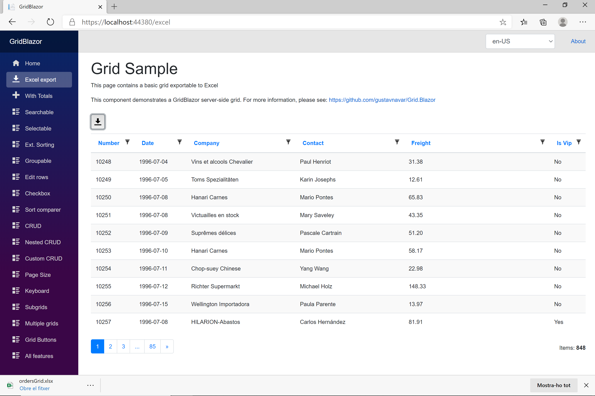

## Blazor WASM with OData back-end

# Export to Excel

[Index](Documentation.md)

Grids can be exported to an Excel file. You have to use the ```SetExcelExport``` method of the ```GridClient``` object:
 
```c#
    var client = new GridODataClient<Order>(HttpClient, url, query, false, "ordersGrid", columns, 10)
        .SetExcelExport(true, false, "Orders"));
```

The ```SetExcelExport``` method has 3 parameters, one of them is required:

Parameter | Description
--------- | -----------
enabled | bool to enable Excel export (required)
allRows | bool to enable export of all grid rows (optional). The default value is false and only visible rows are exported
fileName | string to define the file name (optional). If no value is defined, the grid internal name is used as file name

This is an example of a grid with an export to Excel button:



Grid columns can be customised as hidden (or not) specifically when exporting to Excel; either by calling SetExcelHidden(bool?) or setting the ExcelHidden property on the column definition.

[<- Embedded components on the grid](Embedded_components.md) | [Grid dimensions ->](Grid_dimensions.md)
