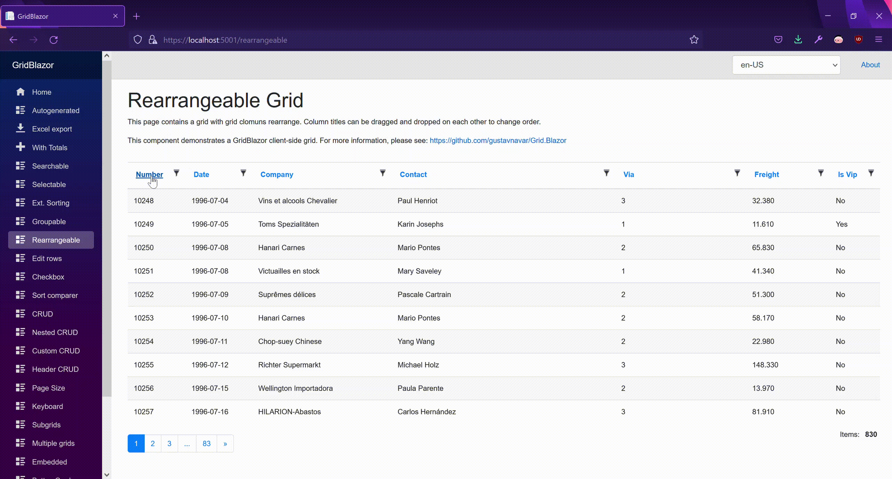

## Blazor WASM with OData back-end

# Column Rearrangememt

[Index](Documentation.md)

You can enable rearrange column order by drag and drop a grid using the **RearrangeableColumns** method for **GridODataClient** objects:
* razor page
    ```c#
        var client = new GridODataClient<Order>(httpClient, url, query, false, "ordersGrid", columns, 10, locale)
            .RearrangeableColumns()
    ```


You can drag the column title and drop it on another column. 
The grid with higlight columns on which it will be dropped and pin will show place where column will be inserted after drop.

This is an example of a table of items using rearrange:




[<- Grouping](Grouping.md) | [Selecting row ->](Selecting_row.md)