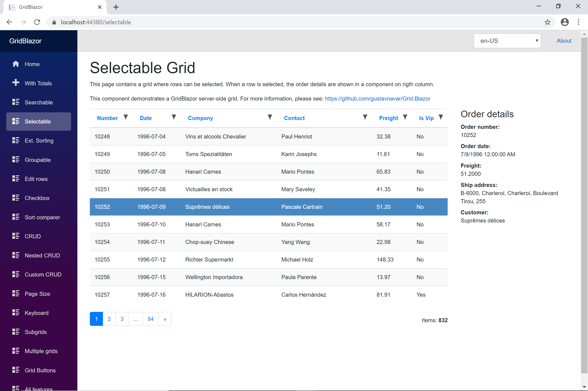
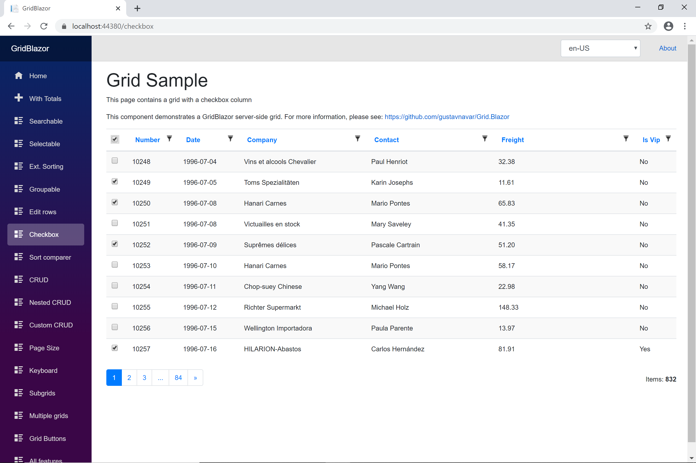

## Blazor WASM with OData back-end

# Selecting row

[Index](Documentation.md)

There are 2 ways to configure selecting rows:
- using the ```Selectable``` method of the ```GridODataClient``` object
- using the ```SetCheckboxColumn``` or ```SetSingleCheckboxColumn``` methods on the column definition

## Selectable method

The ```GridOdataClient``` object has a method called ```Selectable``` to configure if a row can be selected. 
It's value can be ```true``` and ```false```. 
Since the version 1.1.0 of the GridBlazor nuget package the default value of the ```Selectable``` feature is ```false``` (it was ```true``` for earlier versions).

There are optional parameters to control selection behavior:

- Auto Select First Row:
    There is an optional boolean parameter to control if the first row should automatically be selected when a page loads.
    It's value can be ```true``` and ```false```. 
    By default this parameter's value is ```false```. 
- Allow Multi Select:
    There is an optional boolean paramter to control if multiple rows can be selected. 
    It's value can be ```true``` and ```false```.
    By default this parameter's value is ```false```.
    You can select multiple rows while pressing the [Ctrl] key
    You select multiple adjacent rows by clicking on the first row holding down the [Shift] key and then clicking on the last row of the interval keeping the [Shift] key held down

Rows configured in this way will be highlighted when selected.

You can enable it as follows:
```c#
    var client = new GridODataClient<Order>(httpClient, url, query, false, "ordersGrid", columns, 10)
        .Selectable(true, true, true);
```

You have to add the ```OnRowClicked``` attribute on the component. For example, the razor page can contain the following line:
```razor
    <GridComponent T="Order" Grid="@_grid" OnRowClicked="@OrderDetails"></GridComponent>
```

Then you have to add the function called by the event. In this example its name is ```OrderDetails```:
```c#
    protected void OrderDetails(object item)
    {
        Order order = null;
        if (item.GetType() == typeof(Order))
        {
            order = (Order)item;
        }
        Console.WriteLine("Order Id: " + (order == null ? "NULL" : order.OrderID.ToString()));
    }
```

In this sample a line of text with the selected row id is writen on the console log.

When items are selected in grid, collection of selected items are available using ```SelectedItems``` property. ```SelectedItems``` property is of type IEnumerable<object>.

```c#
    var items = client.Grid.SelectedItems.ToList<T>();
```

In the GridBlazorOData.Client project you will find another example where the order details are shown on a component when a row is selected.

### Selecting rows for subgrids

GridBlazor 1.3.30 and newer versions implement ```OnRowClickedActions``` to allow row click for all subgrids.

You have to create a ```List<Action<object>>()``` and add all row click method for nested subgrids in the same order they are nested:

```c#
    _rowClickActions = new List<Action<object>>();
    _rowClickActions.Add(OrderInfo);
    _rowClickActions.Add(OrderDetailInfo);
```

And finally you have to pass the list as parameter of the ```GridComponent```:

```c#
    <GridComponent T="Order" Grid="@_grid" OnRowClickedActions="@_rowClickActions" />
```

This is an example of grid using ```Selectable```:




## SetCheckboxColumn method

You can add one or more columns with checkboxes on each row.

```c#
    c.Add("CheckboxColumn").SetCheckboxColumn(true, o => o.Customer.IsVip);
    c.Add(o => o.OrderID).SetPrimaryKey(true);
```

Columns defined in this way must be not connected ones (defined with ```Add()``` method). But they can have a name (defined with ```Add("columnName")``` method).

It's also mandatory to identify the columns that are primary keys for the grid. You must do it using the ```SetPrimaryKey(true)``` method for the primary key columns' definitions.

```SetCheckboxColumn``` method has 3 parameters:
- headerCheckbox: it's a boolean value to enable the checkbox on the header
- expression: it's a ```Func<T, bool>``` to define the initial value of the checkbox for each row
- readonlyExpr (optional): it's a ```Func<T, bool>``` to configure the checkbox for each row as read only

**Important:** ```CheckedRows``` property is not available since release 1.6.2. ```CheckedRows``` only allowed to retrieve the checked values, but not to change them. Use the ```Checkboxes``` property instead of it.

If you want to retrieve or change the checked values for each row, you can use the ```Checkboxes``` property of the ```GridComponent``` object. 
It is a dictionary that contains references to all checkbox components for each column.

Row IDs are the keys of this dictionary. Rows are numbered starting by 0.

The ```CheckboxComponent<T>``` object contains 2 methods to get and set the checked value:
- IsChecked(): It retrieves the current value
- SetChecked(bool): It changes the checkbox value

This is an example showing how to access both methods:
```c#
    private GridComponent<Order> _gridComponent;
    
    ...
    
    Dictionary<int, CheckboxComponent<Order>> checkboxes = _gridComponent.Checkboxes.Get("CheckboxColumn");
    bool isChecked = checkboxes[0].IsChecked();
    if (isChecked)
        await checkboxes[0].SetChecked(false);
```

Blazor pages using checkboxes may require to use the ```ShouldRender``` method to suppress UI refreshing. See this [sample](https://github.com/gustavnavar/Grid.Blazor/blob/master/GridBlazorOData.Client/Pages/Checkbox.razor) as reference.

These events are provided by the ```GridComponent``` object to allow running tasks on changing checkboxes:
- ```Func<CheckboxEventArgs<T>, Task> HeaderCheckboxChanged```: it's fired when a header checkbox is changed
- ```Func<CheckboxEventArgs<T>, Task> RowCheckboxChanged```: it's fired when a row checkbox is changed

This is an example of grid using ```SetCheckboxColumn```:



## SetSingleCheckboxColumn method

This case is very similar to the previous one, with the exception of only one checkbox selected at a time. 
When you select a checkbox, any other checkboxes are automatically unchecked.

You can add one or more columns with checkboxes on each row.

```c#
    c.Add("CheckboxColumn").SetSingleCheckboxColumn();
    c.Add(o => o.OrderID).SetPrimaryKey(true);
```
Columns defined in this way must be not connected ones (defined with ```Add()``` method). But they can have a name (defined with ```Add("columnName")``` method).

It's also mandatory to identify the columns that are primary keys for the grid. You must do it using the ```SetPrimaryKey(true)``` method for the primary key columns' definitions.

```SetSingleCheckboxColumn``` method has no parameters.

[<- Rearrange columns](RearrangeColumns.md) | [Searching ->](Searching.md)