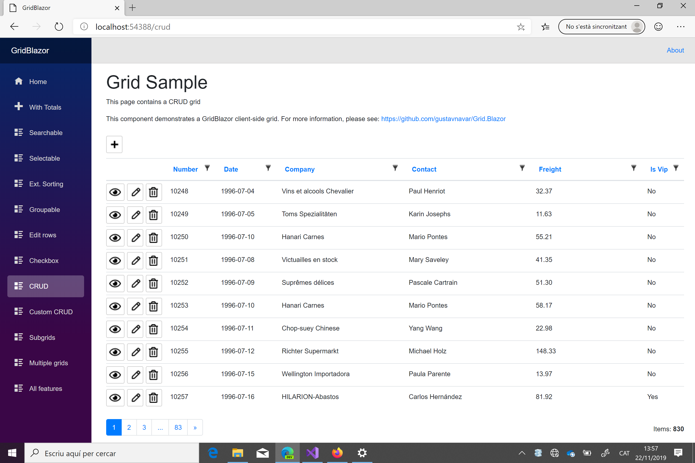
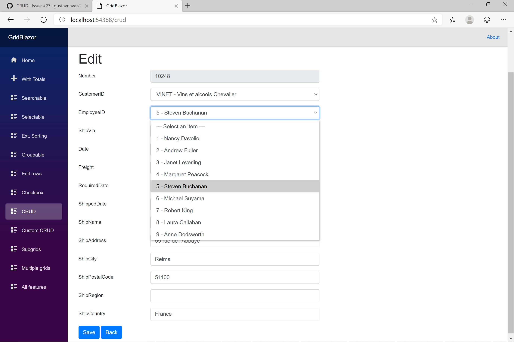

## Blazor server-side

# CRUD

[Index](Documentation.md)

GridBlazor supports CRUD forms to add, edit, view and delete items for Blazor server-side projects.

These are the supported features:
- Full screen forms
- Auto-generated forms with field type detection based on column definition
- Lists for drop-drown fields
- Custom forms
- Support of grid models including 1:N relationships
- Support of entities with multiple foreign keys
- Direct URLs

## Auto-generated forms

You can enable CRUD using the **Crud** method of the **GridClient** object:
```c#
    Action<IGridColumnCollection<Order>> columns = c => ColumnCollections.OrderColumnsWithCrud(c);
        
    var client = new GridClient<Order>(q => orderService.GetOrdersGridRows(columns, q), query, false, "ordersGrid", columns, locale)
        .Crud(true, orderService)
```

**Note**: All 4 crud forms can be enabled at the same time with the ```Crud(bool enabled, ...)``` method, but you can enable one by one using  the ```Crud(bool create, bool read, bool update, bool delete, ...)``` method.

The parameter **crudDataService** of the **Crud** method must be a class that implements the **ICrudDataService<T>** interface. This interface has 4 methods:
- ```Task<T> Get(params object[] keys);```
- ```Task Insert(T item);```
- ```Task Update(T item);```
- ```Task Delete(params object[] keys);```
one for each CRUD operation.

This is an example of those 4 methods:
```c#
    public async Task<Order> Get(params object[] keys)
    {
        using (var context = new NorthwindDbContext(_options))
        {
           int orderId;
           int.TryParse(keys[0].ToString(), out orderId);
           var repository = new OrdersRepository(context);
           return await repository.GetById(orderId);
        }
    }

    public async Task Insert(Order item)
    {
        using (var context = new NorthwindDbContext(_options))
        {
            var repository = new OrdersRepository(context);
            await repository.Insert(item);
            repository.Save();
        }
    }

    public async Task Update(Order item)
    {
        using (var context = new NorthwindDbContext(_options))
        {
            var repository = new OrdersRepository(context);
            await repository.Update(item);
            repository.Save();
        }
    }

    public async Task Delete(params object[] keys)
    {
        using (var context = new NorthwindDbContext(_options))
        {
            var order = await Get(keys);
            var repository = new OrdersRepository(context);
            repository.Delete(order);
            repository.Save();
        }
    }
```

The best way to avoid threading and cache issues for Blazor Server App projects is to create a DbContext inside each method with **using**. 
Dependency injection for DbContext can produce threading and cache issues.

### Column definition

The column definition must include the primary keys:
- using the **SetPrimaryKey(true)** method for columns with auto-generated keys, or
- using the **SetPrimaryKey(true, false)** method for columns with manually generated keys, or
- using the **SetPrimaryKey(true).SetSelectField(...)**  method for columns with keys selected from a list

If the grid model includes foreign keys, the column definition should include them using the **SetSelectField** in order to get the options for the ```<select>``` element.

The **SetSelectField** method has 3 required parameters:
Parameter | Description
--------- | -----------
enabled | boolean to configure if the field is shown as a ```<select>``` html element
expression | function to get the selected value for update and delete forms (it must return an string value)
selectItemExpr | function to get the values and titles to be shown in the drop-down of create and update forms (it must return an ```IEnumerable<SelectItem>```)

The type of fields currently supported as foreign keys are:
- string
- DateTime
- DateTimeOffset
- TimeSpan
- Int16
- Int32
- Int64
- UInt16
- UInt32
- UInt64
- Byte
- Single
- Double
- Decimal
- bool
- Guid

This is an example of function to get values and title for a drop-down:

```c#
    public IEnumerable<SelectItem> GetAllEmployees()
    {
       using (var context = new NorthwindDbContext(_options))
       {
           EmployeeRepository repository = new EmployeeRepository(context);
           return repository.GetAll()
               .Select(r => new SelectItem(r.EmployeeID.ToString(), r.EmployeeID.ToString() + " - " 
                  + r.FirstName + " " + r.LastName))
               .ToList();
        }
   }
```

As explained for the 4 CRUD methods, the best way to avoid threading and cache issues for Blazor Server App projects is to create a DbContext inside the function with **using**. 

Other fields that you want to be shown as dropdowns with a closed list can also be configured with the ```SetSelectField``` method.

All fields to be included in the CRUD forms but not in the grid as columns should be configured as hidden (e.g. ```Add(o => o.RequiredDate, true)```).

All columns required to be included in the Update form as **read only** should be configured using the ```SetReadOnlyOnUpdate(true)``` method.

If a column is a date that has to be shown as ```date```, ```time``` or ```datetime-local``` in the CRUD forms, the column definition should use the  **SetInputType** method in order to get the correct format.

If a column is a string that has to be shown as ```<textarea>``` in the CRUD forms, the column definition should use the  **SetInputType** method in order to get the correct html element.

The **SetInputType** method has 1 required parameter:
Parameter | Description
--------- | -----------
inputType | ```InputType``` enum. Its value can be ```InputType.TextArea```, ```InputType.Date```, ```InputType.Time``` or ```InputType.DateTimeLocal```

You can also add components on the CRUD forms using the ```RenderCrudComponentAs<TComponent>``` method. You must define these columns as **Hidden** to show them just on CRUD forms.

And finally all columns included in the grid but not in the CRUD forms should be configured as "CRUD hidden" using the ```SetCrudHidden(true)``` method.

**Notes**: 
- You can have more granularity in the "CRUD hidden" configuration. You can use the ```SetCrudHidden(bool create, bool read, bool update, bool delete)``` method to configure the columns that will be hidden on each type of form.
- You can have more granularity in the components configuration.  You can use the ```RenderCrudComponentAs<TCreateComponent, TReadComponent, TUpdateComponent, TDeleteComponent>``` method to configure the components that will be shown on each type of form. Id you don't want to show any component for a specific type of form you must use ```NullComponent```

This is an example of column definition:

```c#
    Action<IGridColumnCollection<Order>> columns = c =>
    {
        c.Add(o => o.OrderID).SetPrimaryKey(true);
        c.Add(o => o.CustomerID, true).SetSelectField(true, o => o.Customer.CustomerID + " - " + o.Customer.CompanyName,
            customerService.GetAllCustomers);
        c.Add(o => o.EmployeeID, true).SetSelectField(true, o => o.Employee.EmployeeID.ToString() 
            + " - " + o.Employee.FirstName + " " + o.Employee.LastName, employeeService.GetAllEmployees);
        c.Add(o => o.ShipVia, true).SetSelectField(true, o => o.Shipper == null ? "" : o.Shipper.ShipperID.ToString() 
            + " - " + o.Shipper.CompanyName, shipperService.GetAllShippers);
        c.Add(o => o.OrderDate, "OrderCustomDate").Titled(SharedResource.OrderCustomDate).Format("{0:yyyy-MM-dd}");
        c.Add(o => o.Customer.CompanyName).Titled(SharedResource.CompanyName).SetReadOnlyOnUpdate(true);
        c.Add(o => o.Customer.ContactName).Titled(SharedResource.ContactName).SetCrudHidden(true);
        c.Add(o => o.Freight).Titled(SharedResource.Freight).Format("{0:F}");
        c.Add(o => o.Customer.IsVip).Titled(SharedResource.IsVip).RenderValueAs(o => o.Customer.IsVip ? "Yes" : "No").SetCrudHidden(true);
        c.Add(o => o.RequiredDate, true).Format("{0:yyyy-MM-dd}");
        c.Add(o => o.ShippedDate, true).Format("{0:yyyy-MM-dd}");
        c.Add(o => o.ShipName, true);
        c.Add(o => o.ShipAddress, true);
        c.Add(o => o.ShipCity, true);
        c.Add(o => o.ShipPostalCode, true);
        c.Add(o => o.ShipRegion, true);
        c.Add(o => o.ShipCountry, true);
    };
```

This is an example of a grid using CRUD:



And this is an auto-genereated edit form:



## Custom forms (Optional)

If you want to use custom forms you can enable them using the **SetCreateComponent**, **SetReadComponent**, **SetUpdateComponent** and **SetDeleteComponent**  methods of the **GridClient** object:

```c#
    var client = new GridClient<Order>(q => orderService.GetOrdersGridRows(columns, q), query, false, "ordersGrid", columns, locale)
        .Crud(true, orderService)
        .SetCreateComponent<OrderCreateComponent>()
        .SetReadComponent<OrderReadComponent>()
        .SetUpdateComponent<OrderUpdateComponent>()
        .SetDeleteComponent<OrderDeleteComponent>();
```

You can define all custom forms or just some of them. If you don't define a custom form for one of the enabled operations an auto-generated form will be used instead.

And finally you will have to create a Blazor component for the custom form. This is an example of edit form:

```razor
@using GridBlazor
@using GridBlazor.Resources
@using GridBlazorServerSide.Models
@inherits GridUpdateComponentBase<Order>

<h1>@Strings.Add Order</h1>
<EditForm Model="@Item" OnValidSubmit="@UpdateItem">
    <DataAnnotationsValidator />
    <ValidationSummary />

    <div class="form-horizontal">
        <div class="form-group">
            <label for="OrderID" class="control-label col-md-2">OrderID: </label>
            <div class="col-md-5">
                <InputNumber id="OrderID" class="form-control" readonly="readonly" @bind-Value="Item.OrderID" />
            </div>
        </div>

        <div class="form-group">
            <label for="CustomerID" class="control-label col-md-2">Customer Id: </label>
            <div class="col-md-5">
                <InputText id="CustomerID" class="form-control" @bind-Value="Item.CustomerID" />
            </div>
        </div>

        <div class="form-group">
            <label for="EmployeeID" class="control-label col-md-2">Employee Id: </label>
            <div class="col-md-5">
                <InputNumber id="EmployeeID" class="form-control" @bind-Value="Item.EmployeeID" />
            </div>
        </div>

        <div class="form-group">
            <label for="ShipVia" class="control-label col-md-2">Ship Via: </label>
            <div class="col-md-5">
                <InputNumber id="ShipVia" class="form-control" @bind-Value="Item.ShipVia" />
            </div>
        </div>

        <div class="form-group">
            <label for="RequiredDate" class="control-label col-md-2">Required Date: </label>
            <div class="col-md-5">
                <InputDate id="RequiredDate" class="form-control" @bind-Value="Item.RequiredDate" />
            </div>
        </div>

        <div class="form-group">
            <label for="ShippedDate" class="control-label col-md-2">Shipped Date: </label>
            <div class="col-md-5">
                <InputDate id="ShippedDate" class="form-control" @bind-Value="Item.ShippedDate" />
            </div>
        </div>

        <div class="form-group">
            <label for="ShipName" class="control-label col-md-2">Ship Name: </label>
            <div class="col-md-5">
                <InputText id="ShipName" class="form-control" @bind-Value="Item.ShipName" />
            </div>
        </div>

        <div class="form-group">
            <label for="ShipAddress" class="control-label col-md-2">Ship Address: </label>
            <div class="col-md-5">
                <InputText id="ShipAddress" class="form-control" @bind-Value="Item.ShipAddress" />
            </div>
        </div>

        <div class="form-group">
            <label for="ShipCity" class="control-label col-md-2">Ship City: </label>
            <div class="col-md-5">
                <InputText id="ShipCity" class="form-control" @bind-Value="Item.ShipCity" />
            </div>
        </div>

        <div class="form-group">
            <label for="ShipPostalCode" class="control-label col-md-2">Ship Postal Code: </label>
            <div class="col-md-5">
                <InputText id="ShipPostalCode" class="form-control" @bind-Value="Item.ShipPostalCode" />
            </div>
        </div>

        <div class="form-group">
            <label for="ShipRegion" class="control-label col-md-2">Ship Region: </label>
            <div class="col-md-5">
                <InputText id="ShipRegion" class="form-control" @bind-Value="Item.ShipRegion" />
            </div>
        </div>

        <div class="form-group">
            <label for="ShipCountry" class="control-label col-md-2">Ship Country: </label>
            <div class="col-md-5">
                <InputText id="ShipCountry" class="form-control" @bind-Value="Item.ShipCountry" />
            </div>
        </div>

        <div class="form-group">
            <label for="Freight" class="control-label col-md-2">Freight: </label>
            <div class="col-md-5">
                <input id="Freight" name="Freight" class="form-control" @bind="Item.Freight" />
            </div>
        </div>

        <div class="form-group">
            <div class="col-md-5">
                <button type="submit" class="btn btn-primary btn-md">@Strings.Save</button>
                <button type="button" class="btn btn-primary btn-md" @onclick="BackButtonClicked">@Strings.Back</button>
            </div>
        </div>
    </div>
</EditForm>
``` 

**Note**: The Blazor component must be to inherited from the **GridUpdateComponentBase<T>** class.

If you want to use a drop-down list for a field you have to define it as it was for auto-generated forms.

## Direct URLs

You can configure a direct route to an specific CRUD form. The first step is to roure alternative routes as follows:

```c#
@page "/crud"
@page "/crud/{OrderId}/{Mode}"
```

Then you have to create and initialize the following parameters:
- ```GridMode ``` for the type of CRUD form
- ```object[]``` for the primary keys of the row to be shown on the form 

This is an example of these parameters initialization:

```c#
@code
{
    ...

    private object[] _keys;
    private GridMode _mode;
    
    ...

    protected override async Task OnParametersSetAsync()
    {
        var locale = CultureInfo.CurrentCulture;
        SharedResource.Culture = locale;

        var query = new QueryDictionary<StringValues>();

        Action<IGridColumnCollection<Order>> columns = c => ColumnCollections.OrderColumnsWithCrud(c,
            customerService.GetAllCustomers, employeeService.GetAllEmployees, shipperService.GetAllShippers);
        var client = new GridClient<Order>(q => orderService.GetOrdersGridRows(columns, q),
            query, false, "ordersGrid", columns, locale)
            .Sortable()
            .Filterable()
            .SetStriped(true)
            .Crud(true, orderService)
            .WithMultipleFilters()
            .WithGridItemsCount();

        _grid = client.Grid;

        if (!string.IsNullOrWhiteSpace(OrderId))
        {
            int orderId;
            bool result = int.TryParse(OrderId, out orderId);
            if (result)
            {
                if (Mode.ToLower() == "create")
                {
                    _keys = new object[] { orderId };
                    _mode = GridMode.Create;
                }
                else if (Mode.ToLower() == "read")
                {
                    _keys = new object[] { orderId };
                    _mode = GridMode.Read;
                }
                else if (Mode.ToLower() == "update")
                {
                    _keys = new object[] { orderId };
                    _mode = GridMode.Update;
                }
                else if (Mode.ToLower() == "delete")
                {
                    _keys = new object[] { orderId };
                    _mode = GridMode.Delete;
                }
            }
        }

        // Set new items to grid
        _task = client.UpdateGrid();
        await _task;
    }

    ...
```

And finaly you have to pass the paramenters initialized before to the ```GridComponent```

```c#
<GridComponent T="Order" Grid="@_grid" Mode="_mode" Keys="_keys"></GridComponent>
``` 

[<- Passing grid state as parameter](Passing_grid_state_as_parameter.md) | [Nested CRUD ->](Nested_crud.md)