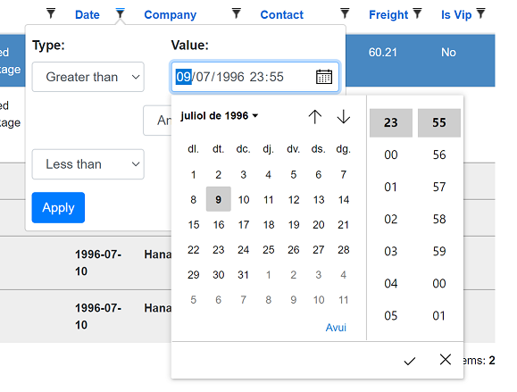
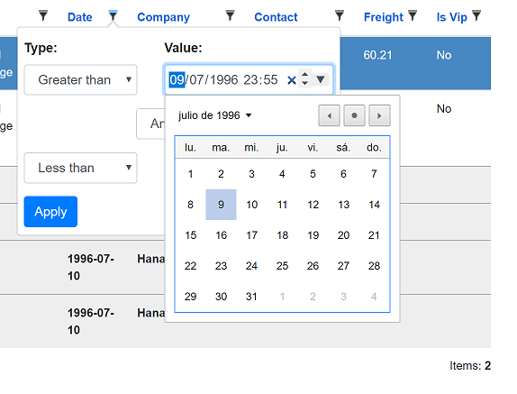
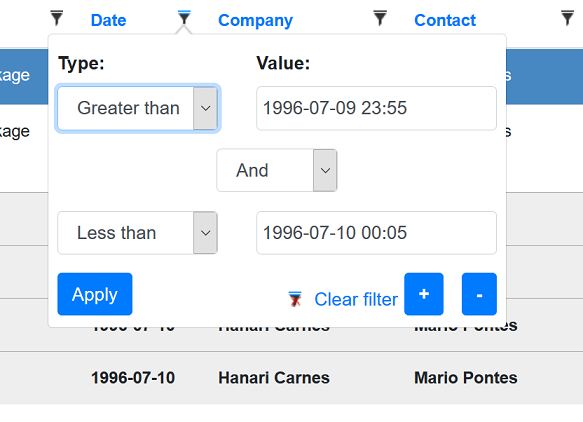

## Blazor server-side

# Using a date time filter

[Index](Documentation.md)

The default behavior for a ```DateTime``` column is to use a filter widget that allows only date picking. 

But it's also possible to use a date time picker, where users can select year, month, day, hour, and minute info. Seconds are not supported.

You have to add the column using the ```SetFilterWidgetType``` method of the ```GridColumn``` object using the parameter value "DateTimeLocal":

```c#
    c.Add(o => o.OrderDate).SetFilterWidgetType("DateTimeLocal");
``` 

The UI shown by the widget will depend on the browser used:

- Edge Chromium will show a datetime picker:

    

- Chrome and Opera will show a date picker, but time must be selected manually:

    

- Firefox will only allow to wirte date and time manually in "yyyy-mm-dd hh:mm" format:

    

[<- Using a list filter](Using_list_filter.md) | [Creating custom filter widget ->](Creating_custom_filter_widget.md)