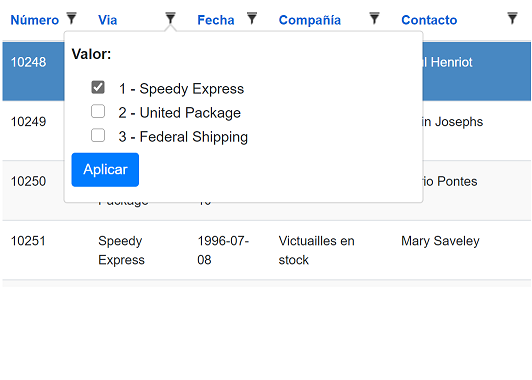
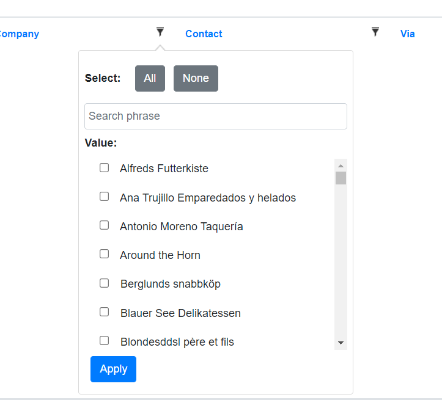

## Blazor server-side

# Using a list filter

[Index](Documentation.md)

There can be columns where their values can only be selected from a short list. 
You can use an special filter based on a list for those columns. 
It looks like:



In order to use a list filter you have to create a list of ```SelectItem``` objects in the ```OnParametersSetAsync``` method of the razor page:

```c#
    ...
    var shippers = shipperService.GetAllShippers();
    ...
``` 

Then you have to add the column using the ```SetListFilter``` method of the ```GridColumn``` object:
```c#
    c.Add(o => o.ShipVia)
        .RenderValueAs(o => o.Shipper.CompanyName)
        .SetListFilter(shippers, true, true);
``` 

## SetListFilter parameters

Parameter | Description 
--------- | -----------
selectItems | list of ```SelectItem``` objects to be shown on the list
includeIsNull (optional) | bool to show a list item to select null items
includeIsNotNull (optional) | bool to show a list item to select no-null items
filterOptions (optional) | ```Action<ListFilterOptions>``` to configure all list filter options

```includeIsNull``` default value is ```false```, and ```includeIsNotNull``` default value is ```false```.

## ListFilterOptions attributes

Parameter | Description
--------- | -----------
IncludeIsNull (optional) | bool to show a list item to select null items
IncludeIsNotNull (optional) | bool to show a list item to select no-null items
ShowSelectAllButtons (optional) | bool to show buttons to select all / none item
ShowSearchInput (optional) | bool to show a text box to filter the items shown on the list

Default value for all attributes is ```false```.

## List filter with search input

You can add searching features to the list filter. You have to add the column using the ```SetListFilter``` method of the ```GridColumn``` object as follows:
```c#
    c.Add(o => o.ShipVia)
        .RenderValueAs(o => o.Shipper.CompanyName)
        .SetListFilter(_shippers, o => {
            o.ShowSelectAllButtons = true;
            o.ShowSearchInput = true;
        });
```

The result looks like:



[<- Filtering](Filtering.md) | [Using a date time filter ->](Using_datetime_filter.md)