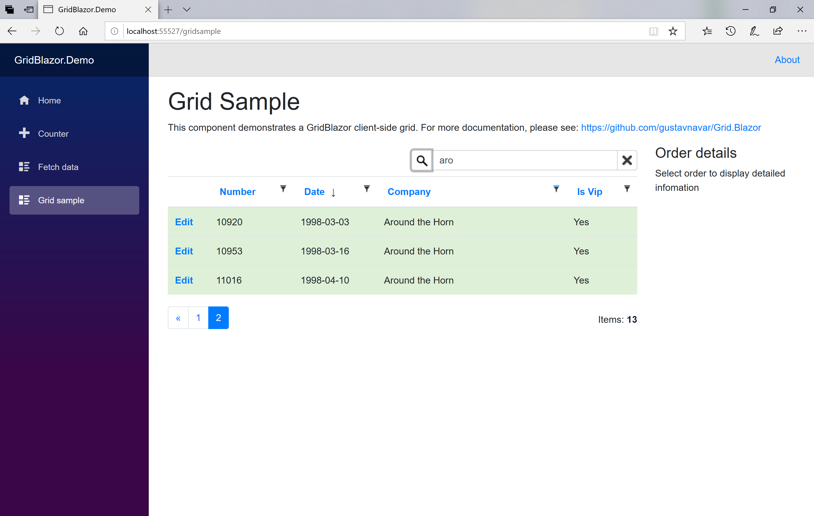

## GridMvc for ASP.NET Core MVC

# Searching

[Index](Documentation.md)

You can enable the searching option for your grid. Searching allows to search for a text on all columns at the same time.



You can enable searching for all columns of a grid using the **Searchable** method of the **SGrid** object:

```razor
    @await Html.Grid(Model).Columns(columns =>
    {
        columns.Add(foo => foo.Title);
        columns.Add(foo => foo.Description);
    }).Searchable(true, false, true).RenderAsync()
```

## Searching parameters

Parameter | Description | Example
--------- | ----------- | -------
enable (optional) | bool to enable searching on the grid | Searchable(true, ...)
onlyTextColumns (optional) | bool to enable searching on all collumns or just on string ones | Searchable(..., true, ...)
hiddenColumns (optional) | bool to enable searching on hidden columns | Searchable(..., true)
searchOptions (optional) | ```Action<SearchOptions>``` to configure all search options

```enable``` default value is ```true```, ```onlyTextColumns``` default value is ```true```, and ```hiddenColumns``` default value is ```false```.

## SearchOptions attributes

Parameter | Description
--------- | -----------
Enabled (optional) | bool to enable searching on the grid
OnlyTextColumns (optional) | bool to enable searching on all collumns or just on string ones
HiddenColumns (optional) | bool to enable searching on hidden columns
SplittedWords (optional) | bool to enable search of any word contained in the search phrase on any column. The defaul behavior is to search the complete search phrase on any column.

```Enabled``` default value is ```true```, ```OnlyTextColumns``` default value is ```true```, ```HiddenColumns``` default value is ```false```, and ```SplittedWords ``` default value is false.

Searching on boolean columns has been disabled because EF Core 3.0 is not supporting it yet.

**IMPORTANT**: If you get an **InvalidOperationException** while searching with a message similar to:
```text
Error generated for warning 'Microsoft.EntityFrameworkCore.Query.QueryClientEvaluationWarning: The LINQ expression 'where ...' could not be translated and will be evaluated locally.'. This exception can be suppressed or logged by passing event ID 'RelationalEventId.QueryClientEvaluationWarning' to the 'ConfigureWarnings' method in 'DbContext.OnConfiguring' or 'AddDbContext'.
``` 
Then you must enable query client evaluation on the ORM (EF Core). You can enable it adding the following line to the **Startup.cs** file:
```c#
    options.ConfigureWarnings(warnings => warnings.Ignore(RelationalEventId.QueryClientEvaluationWarning)); 
```
Keep in mind that enabling query client evaluation on the ORM (EF Core) can have a big impact on performance.


[<- Selecting row](Selecting_row.md) | [Filtering ->](Filtering.md)