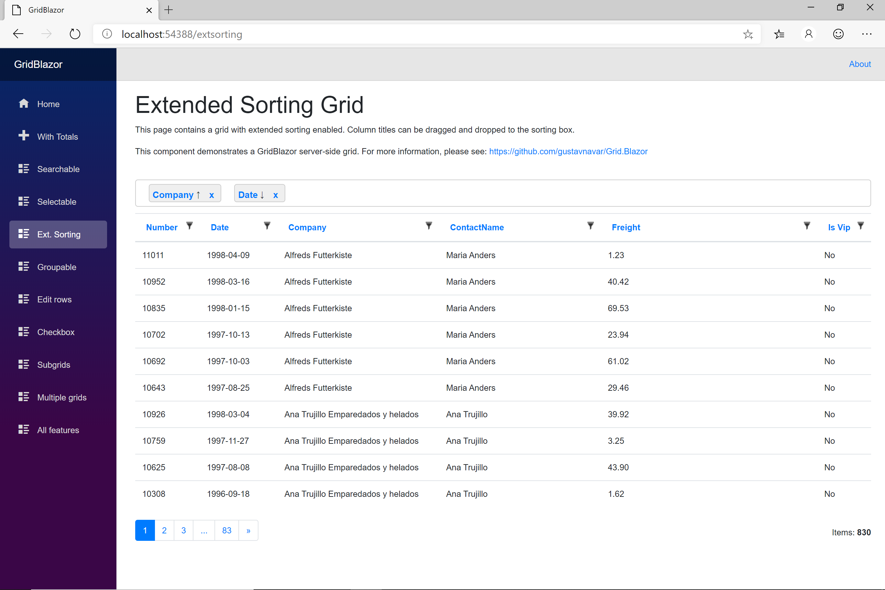

## GridMvc for ASP.NET Core MVC

# Sorting

[Index](Documentation.md)

## Regular Sorting
You can enable sorting for all columns of a grid using the **Sortable** method of the **Grid** object:
```razor
    @await Html.Grid(Model).Columns(columns =>
    {
        columns.Add(foo => foo.Title);
        columns.Add(foo => foo.Description);
    }).Sortable().RenderAsync()
```

In this case you can select sorting pressing the column name on just one column at a time.

Sorting at grid level has precendence over sorting defined at column level.

## Extended Sorting
You can also configure extended sorting using the **ExtSortable** method of the **Grid** object:
```razor
    @await Html.Grid(Model).Columns(columns =>
    {
        columns.Add(foo => foo.Title);
        columns.Add(foo => foo.Description);
    }).ExtSortable(true).RenderAsync()
```

In this case you can drag the column title and drop it on the sorting area. You can add multiple columns at a time and select if sorting is ascending or descending column by column.

This is an example of a table of items using extended sorting:




[<- Totals](Totals.md) | [Grouping ->](Grouping.md)