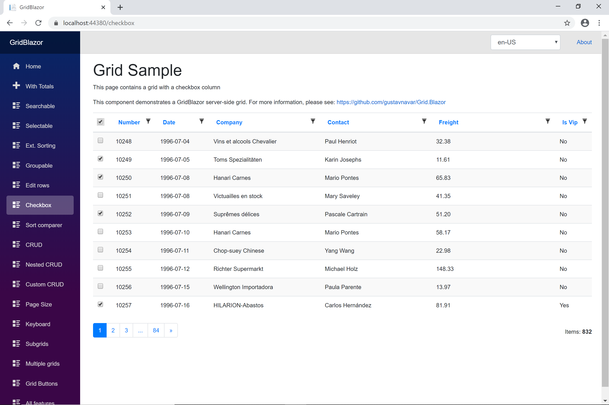

## GridBlazor for ASP.NET Core MVC

# Selecting row

[Index](Documentation.md)

There are 2 ways to configure selecting rows:
- using the ```Selectable``` method of the ```GridClient``` object
- using the ```SetCheckboxColumn``` method on the column definition

## Selectable method

The ```GridClient``` object has a method called ```Selectable``` to configure if a row can be selected. 
It's value can be ```true``` and ```false```. 
Since the version 1.1.0 of the GridBlazor nuget package the default value of the ```Selectable``` feature is ```false``` (it was ```true``` for earlier versions).

There are optional parameters to control selection behavior:

- Auto Select First Row:
    There is an optional boolean parameter to control if the first row should automatically be selected when a page loads.
    It's value can be ```true``` and ```false```. 
    By default this parameter's value is ```false```. 
- Allow Multi Select:
    There is an optional boolean paramter to control if multiple rows can be selected. 
    It's value can be ```true``` and ```false```.
    By default this parameter's value is ```false```.
    You can select multiple rows while pressing the [Ctrl] key

Rows configured in this way will be highlighted when selected.

You can enable it as follows:
```c#
    var client = new GridClient<Order>(q => orderService.GetOrdersGridRows(columns, q), query, false, "ordersGrid", columns)
        .Selectable(true, true, true);
```

You have to add the ```OnRowClicked``` attribute on the component. For example, the razor page can contain the following line:
```razor
    <GridComponent T="Order" Grid="@_grid" OnRowClicked="@OrderDetails"></GridComponent>
```

Then you have to add the function called by the event. In this example its name is ```OrderDetails```:
```c#
    protected void OrderDetails(object item)
    {
        Order order = null;
        if (item.GetType() == typeof(Order))
        {
            order = (Order)item;
        }
        Console.WriteLine("Order Id: " + (order == null ? "NULL" : order.OrderID.ToString()));
    }
```

In this sample a line of text with the selected row id is writen on the console log.

When items are selected in grid, collection of selected items are available using SelectedItems property. SelectedItems property is of type IEnumerable<object>.

```c#
    var items = client.Grid.SelectedItems.ToList<T>();
```

In the GridComponent.Demo project you will find another example where the order details are shown on a component when a row is selected.

### Selecting rows for subgrids

GridBlazor 1.3.30 and newer versions implement ```OnRowClickedActions``` to allow row click for all subgrids.

You have to create a ```List<Action<object>>()``` and add all row click method for nested subgrids in the same order they are nested:

```c#
    _rowClickActions = new List<Action<object>>();
    _rowClickActions.Add(OrderInfo);
    _rowClickActions.Add(OrderDetailInfo);
```

And finally you have to pass the list as parameter of the ```GridComponent```:

```c#
    <GridComponent T="Order" Grid="@_grid" OnRowClickedActions="@_rowClickActions" />
```

This is an example of grid using ```Selectable```:


## SetCheckboxColumn method

You can add one or more columns with checkboxes on each row.

```c#
    c.Add("CheckboxColumn").SetCheckboxColumn(true, o => o.Customer.IsVip).SetWidth(40);
```

Columns defined in this way must be not connected ones (defined with ```Add()``` method). But they can have a name (defined with ```Add("columnName")``` method).

```SetCheckboxColumn``` method has 2 parameters:
- enabled: it's a boolean value to enable the checkbox column
- expression: it's a ```Func<T, bool>``` to define the initial value of the checkbox for each row

If you want to retrieve the checked values for each row, you can use the ```CheckedRows``` property of the ```GridComponent``` object. It is a dictionary that has all checkbox values for each column:

```c#
    private GridComponent<Order> _gridComponent;
    
    ...
    
    List<int> values = _gridComponent.CheckedRows.Get("CheckboxColumn");
```

Row IDs in this list are those of rows with the checkbox checked. If a row ID is not in the list the checkbox is not checked. Rows are numbered starting by 0.

This is an example of grid using ```SetCheckboxColumn```:



[<- Grouping](Grouping.md) | [Searching ->](Searching.md)